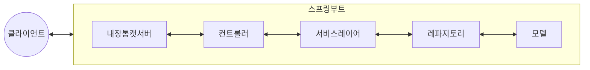

## 스프링부트의 개념

- 스프링 프레임워크를 기반으로 하여 쉽게 독립 실행형 어플리케이션을 만들 수 있도록 도와주는 오픈소스 프레임워크
- 스프링 프레임워크의 복잡한 설정과 구성 문제를 해결하기 위해 등장

## 스프링부트의 구성도, 구성요소, 비교

### 스프링부트의 구성도

### 스프링부트의 구성요소

| 구분 | 내용 | 비고 |
| --- | --- | --- |
| 내장톰캣서버 | 스프링부트 자체 웹서버 | 독립 실행 가능 |
| 컨트롤러 | 사용자 요청 처리, 비지니스 로직 응답 반환 | RestController 등 |
| 서비스레이어 | 비지니스 로직을 처리하는 계층 | DB연동, 트랜잭션 관리 |
| 레파지토리 | DB 접근하여 CRUD 작업 수행 | JpaRepository 등 |
| 모델 | 데이터 구조를 정의하는 클래스 | Entity, DTO |

- Spring Starter, Auto Configurator 등 스프링부트 모듈을 활용하여 쉽게 기본 구성 사용 가능

### 스프링 프레임워크와 스프링부트 비교

| 구분 | 스프링 프레임워크 | 스프링 부트 |
| --- | --- | --- |
| 설정방식 | 수동설정, XML, Properties 등 | 최소설정, 자동설정 |
| 의존성 관리 | 직접 의존성 명시, 관리 | 스타터를 통한 의존성 그룹화, 자동 관리 |
| 내장서버 | 없음 | 있음 |
| 목적 | 엔터프라이즈 앱 개발 등 | REST API 개발 등 |

## 스프링부트 사용시 고려사항

- 많은 어노테이션과 추상화된 설정과 라이브러리를 사용해야하므로, 개발자 숙련도를 고려하여 기능 선택 필요
