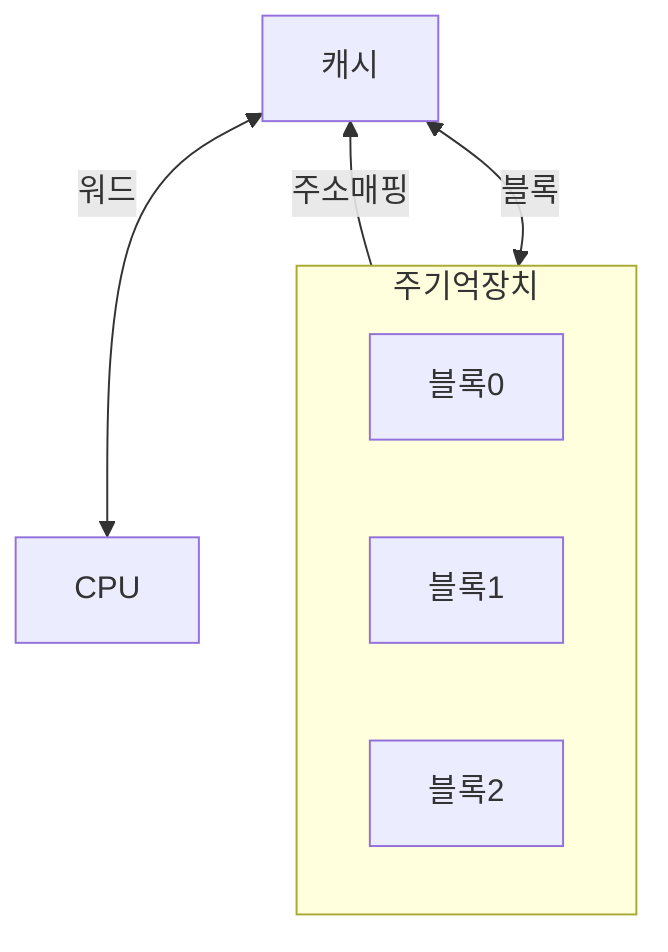
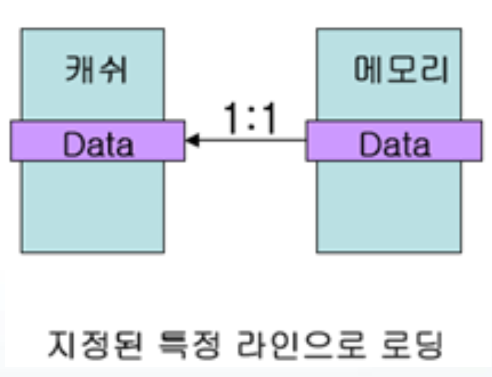
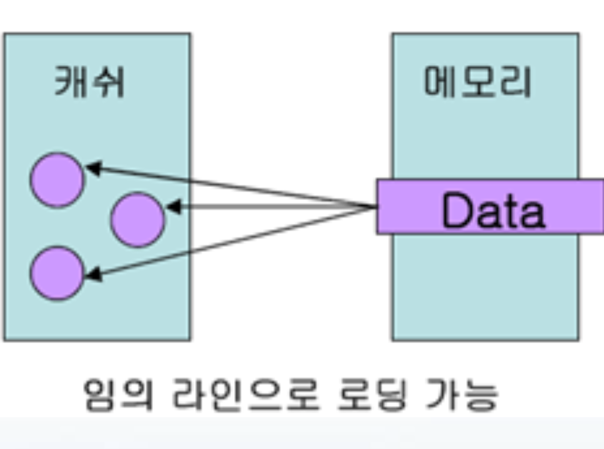
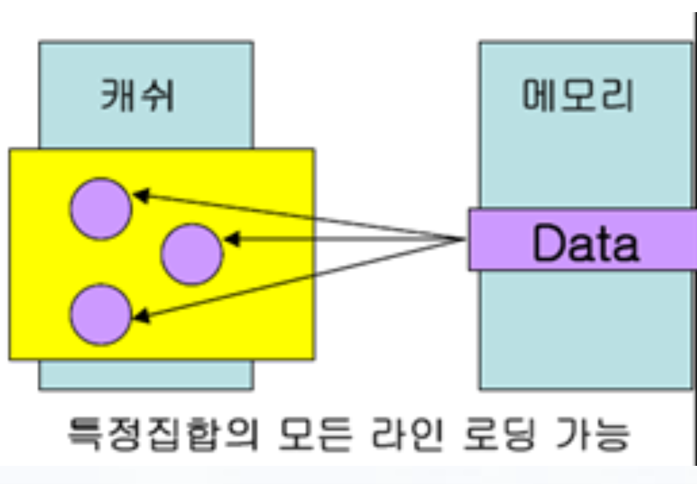
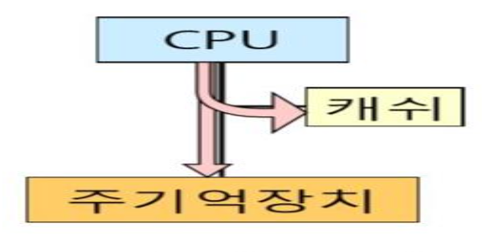
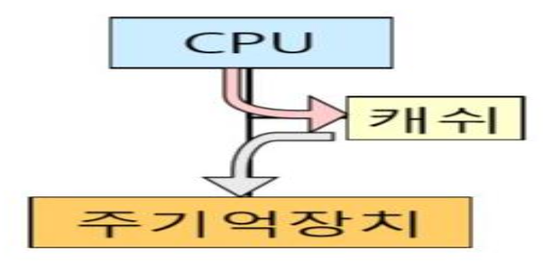
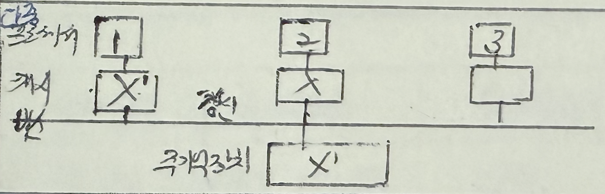
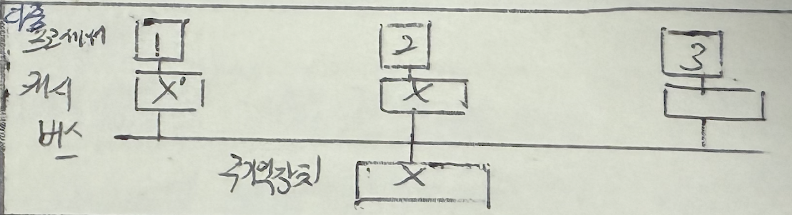

## 캐시 개념

- CPU와 주기억장치 간의 속도차를 완화시켜 프로세서 대기시간을 최소화를 위한 고속 메모리
- 캐시 용량이 메인 메모리보다 작아 일부분만 적재되므로 최고의 적중률을 내기 위해 매핑 기법 필요

## 캐시메모리 매핑 방식

| 구분 | 직접 사상 | 연관 사상 | 집합 연관 사상 |
|---|---|---|---|
| 개념도 |  |  |  |
| 개념 | 메모리 블록이 캐시의 특정 라인으로만 로딩 가능 | 메모리 블록이 임의의 라인으로 로딩 가능 | 메모리 블록이 특정 집합의 모든 라인에 로딩 가능 |
| 장점 | 회로 구현 간단, 처리 속도 향상 | 캐시 적중률 향상 | 캐시:메모리 = N:1로 효율적 |
| 단점 | 캐시 실패율 높음 | 회로 복잡, 처리 속도 느림 | 회로 복잡 |
| 구조 | 지정된 특정 라인으로 로딩 가능 | 임의의 라인으로 로딩 가능 | 특정 집합의 모든 라인에 로딩 가능 |

## 캐시 쓰기 정책

| 구분 | Write-Through | Write-Back |
| --- | --- | --- |
| 개념도 |  |  |
| 개념 | 모든 쓰기 동작들이 캐시와 주기억장치에 동시에 수행되는 방식 | 캐시에서 데이터 변경 후 주기억장치에는 나중에 블록을 복사하여 갱신하는 방식 |
| 특징 | 단순, 일관성 보장 | 쓰기동작 최소화, 짧은 쓰기 시간 |
| | 긴 쓰기 시간, 많은 트래픽 | 일관성 유지 어려움, 블록 교체시 상태 확인 필요 |
| 일관성 문제 |  |  |

## 캐시 일관성 유지 기법

| 구분 | 기법 | 설명 |
|---|---|---|
| SW 기법 | 공유 캐시 사용 | 모든 프로세서가 하나의 공유 캐시를 사용 |
| | | 항상 캐시 일관성이 유지 |
| | | 프로세서 간 캐시 액세스 충돌로 성능 저하 초래 |
| | 공유 변수 캐시 미사용 | 공유변수를 캐시에 저장하지 않는 기법 |
| | | 캐시 저장 불가능 데이터: Lock 변수, 프로세스 큐와 같은 공유 데이터 구조, 입출력 영역에 의해 보호되는 데이터 |
| | | 캐시 적중률 저하 및 I/O 성능 저하 초래 |
| HW 기법 | 디렉토리 프로토콜 | 캐시의 정보 상태(캐시 블록 공유상태, 노드 등)을 주기억장치 디렉토리에 저장하여 일관성을 보장하는 방법 |
| | | Full Map 디렉토리: 디렉토리에 모든 캐시의 포인터와 데이터 저장 |
| | | Limited 디렉토리: Full Map 디렉토리의 기억장소 부담 감소 |
| | | Chained 디렉토리: 캐시 포인터를 linked list로 연결, 기억장소 부담 감소 |
| | | Passive한 방법이며 다중서버 복잡한 시스템에 적합 |
| | 스누피 프로토콜 | 멀티 프로세서 내의 모든 캐시 제어기에 캐시 일관성 유지를 위한 정보를 브로드캐스트하는 기법 |
| | | 스누피 제어기: 다른 프로세서에 의한 메모리 액세스 감지 후 상태 조절 |
| | | 쓰기 갱신(Write Update): Write 발생 시 모든 캐시에 갱신된 정보 전송 |
| | | 쓰기 무효(Write Invalidate): Write 발생 시 Invalid 메시지로 브로드캐스팅 |
| | | MESI 프로토콜: Modified(수정), Exclusive(배타), Shared(2개 이상의 캐시에 공유), Invalid(무효, 다른 캐시가 수정) 4가지 상태로 데이터 유효성 여부 판단 |
| | | Active한 방법, 소규모 시스템, 높은 버스 대역폭 |
| 프로토콜 | 기타 프로토콜 | MEI, MSI, MOESI, MESIF 프로토콜 |
| | | O(Owned): 변경 상태의 캐시 블록을 다른 곳에서 읽은 경우 |
| | | F(Forwarding): 여러 프로세서가 공유한 캐시 블록 접근 시 |
