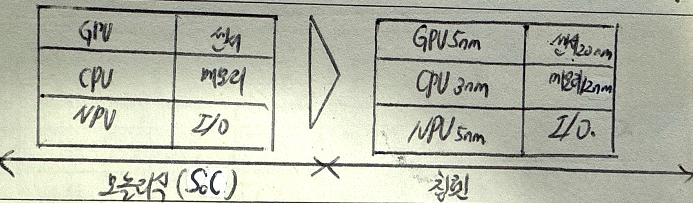
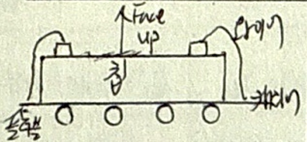
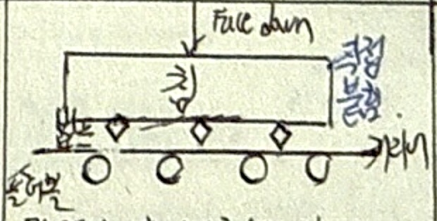
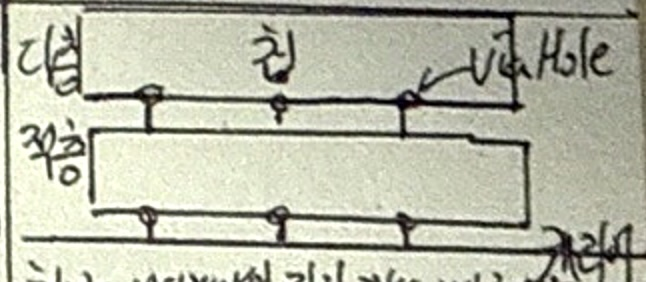

## 칩렛 개념

- 여러 개의 작은 칩(다이)을 모듈화하여 하나의 패키지 안에서 상호연결하는 기술
- 무어의 법칙 한계, 단일 SoC를 나누고 조합하여 유연한 아키텍처 제공, 설계/생산비용 절감

## 칩렛 개념도, 구현 방법, 장점

### 칩렛 개념도

- 다이 슬롯 모듈화로 다양항 기능을 가진 이기종 칩을 결합하여 사용 가능

### 칩렛 구현 방법

| 구분 | 와이어본딩 | 플립칩 본딩 | TSV |
| --- | --- | --- | --- |
| 개념도 |  |  |  |
| 개념 | 칩과 기판 또는 칩 간 연결을 금속 와이어를 통해 구현하는 전통적인 본딩 방식 | 칩과 기판을 플립(뒤집어) 배치한 후, 범프(땜납)로 연결하는 본딩 방식 | 실리콘 웨이퍼에 수직으로 뚫린 구멍(비아)를 통해 칩 내부 및 칩 간 전기 신호를 연결하는 3D 본딩 방식 |
| 특징 | 전기적 신호 전달거리 짧음 | 작은 전기저항, 빠른 속도 | 칩 간 인터커넥션 길이 감소, 빠른 신호전달 |
| | 전기적 특성 우수 | 작은 폼팩터 구현 가능 | 고용량, 저전력 |

### 칩렛 장점

| 구분 | 측면 | 장점 |
| --- | --- | --- |
| 기술적 | 품질측면 | 칩 분할 생산 통한 수율향상 |
| | 제조측면 | 바른 설계와 제작 가능 |
| | 결합측면 | 상이한 이종칩 결합 가능 |
| 산업적 | 비용측면 | 제작 및 설계 비용 감소 |
| | 개발측면 | 핵심 기술 개발 효율 |
| | 시장측면 | 웨이퍼 칩 설계, 제작 진입장벽 낮춤 |

## SoC, SiP, Chiplet 비교

| 구분 | SoC | SiP | Chiplet |
| --- | -- | --- | --- |
| 구조 | 단일 칩 내 모든 기능 통합 | 여러 다이를 하나의 패키지로 통합 | 개별/기능별 모듈형 칩 통합 |
| 유연성 | 낮음 | 중간 | 높음 |
| 성능최적화 | 제한적 | 제한적 | 각 기능별 최적화 가능 |
| 비용효율성 | 낮음 | 중간 | 높음 |
| 개발기간 | 김 | 중간 | 짧음 |
