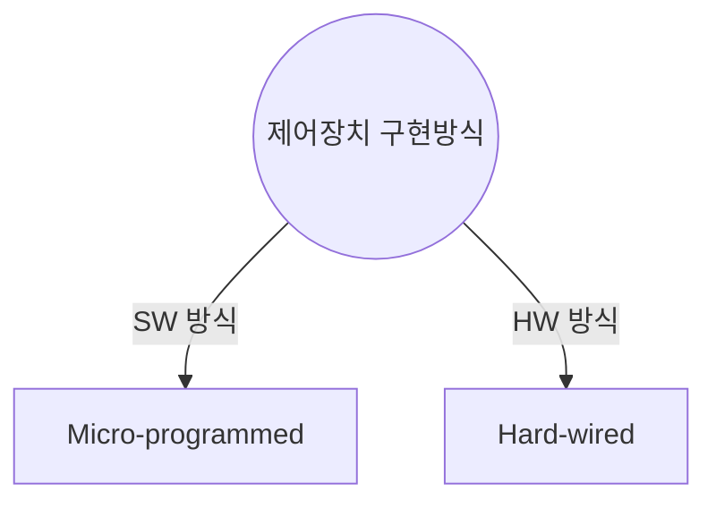
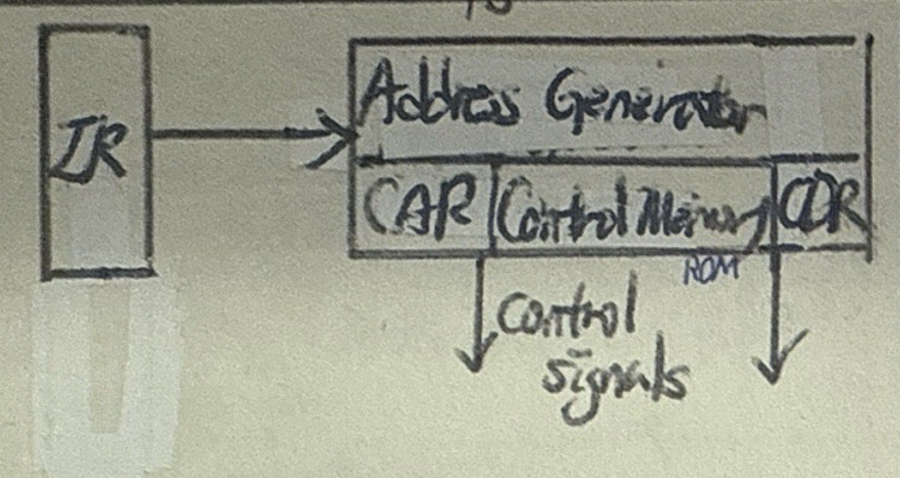
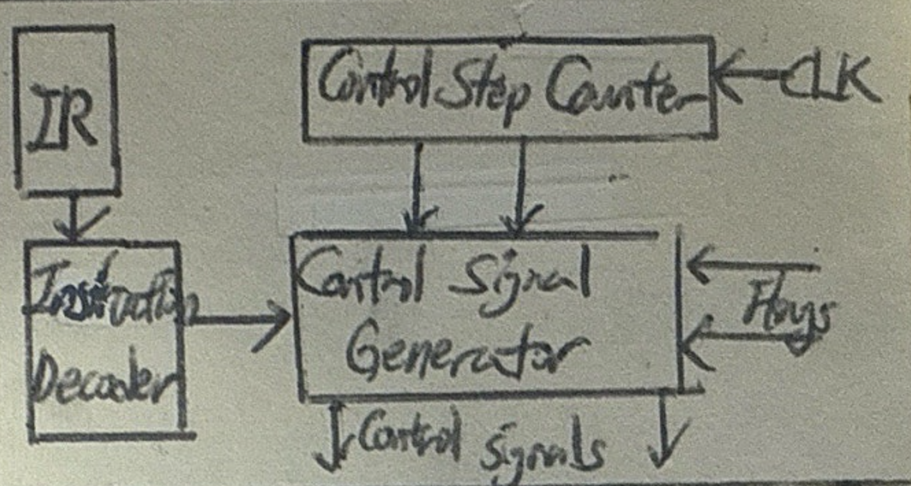

## 제어장치 개념

- 프로그램 명령어를 해석하고, 레지스터에 명령실행 제어 신호를 발생시키는 CPU 구성요소
- 명령어 해독, 제어신호 생성, 제어신호 인가 기능 수행

## Micro-programmed 구현방법 개념 및 구성요소

### Micro-programmed 개념

### Micro-programmed 구성요소

| 구성요소 | 역할 | 설명 |
|---|---|---|
| IR (Instruction Register) | 명령어 저장 | 현재 실행 중인 명령어를 저장하고 제어 메모리 주소를 생성하는 데 사용 |
| Address Generator | 마이크로 명령 주소 생성 | 현재 명령어와 상태를 기반으로 제어 메모리의 다음 주소를 생성 |
| CAR (Control Address Register) | 제어 메모리 주소 저장 | 제어 메모리에서 접근할 주소를 저장 |
| Control Memory (ROM) | 마이크로코드 저장 | 제어 신호 생성을 위한 마이크로 명령어들을 저장 |
| CDR (Control Data Register) | 제어 데이터 저장 | 제어 메모리에서 읽어온 마이크로 명령어를 저장 |
| Control Signals | 제어 신호 | 마이크로 명령어에 따라 생성된 최종 제어 신호 |

## Hard-wired 구현방법 개념 및 구성요소

### Hard-wired 개념

### Hard-wired 구성요소

| 구성요소 | 역할 | 설명 |
|---|---|---|
| IR (Instruction Register) | 명령어 저장 | 현재 실행 중인 명령어를 저장하고 디코더에 전달 |
| Instruction Decoder | 명령어 해독 | IR에서 전달받은 명령어를 해독하여 제어 신호 생성을 준비 |
| Control Step Counter | 클록 기반 스텝 제어 | 클록 신호를 기반으로 명령 실행 단계를 순차적으로 관리 |
| Control Signal Generator | 제어 신호 생성 | 디코더와 스텝 카운터의 정보를 기반으로 제어 신호를 생성 |
| Flags | 상태 플래그 | 연산 결과나 상태 정보를 저장하고 제어 신호 생성에 활용 |

## Micro-programmed, Hard-wired 비교

| 구분 | Micro-programmed | Hard-wired |
| --- | --- | --- |
| 개념 | 제어 메모리에 저장된 마이크로코드를 사용하여 제어 신호를 생성하는 방식 | 고정된 논리 회로를 사용하여 제어 신호를 생성하는 방식 |
| 속도 | 느림, SW 처리 | 빠름, HW 회로 |
| 비용 | 저가 | 고가 |
| 전력소비 | 많음 | 적음 |
| 적용방식 | CISC | RISC |
| 오류발생률 | 디버깅 용이, 수정 가능 | 설계 오류 시 수정 어려움 |
