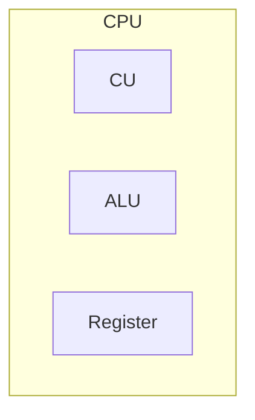
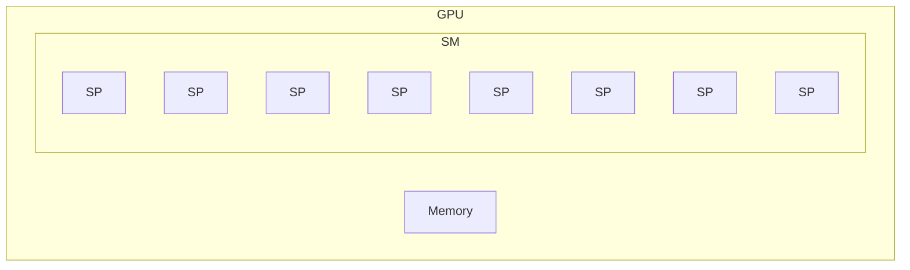
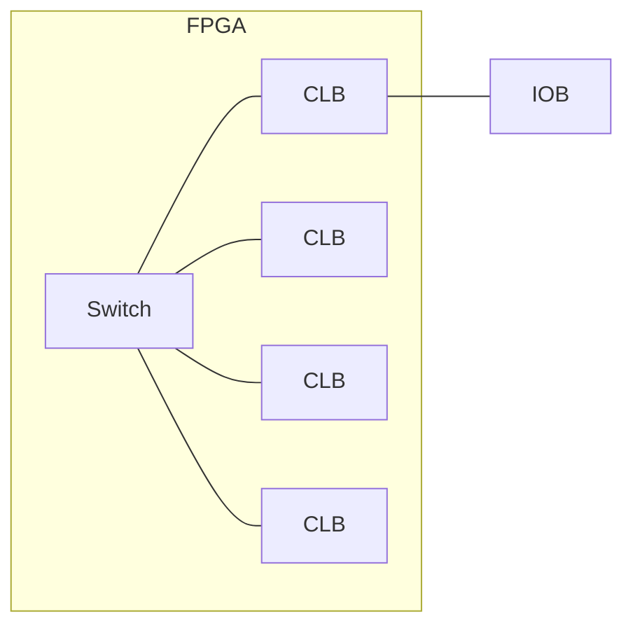
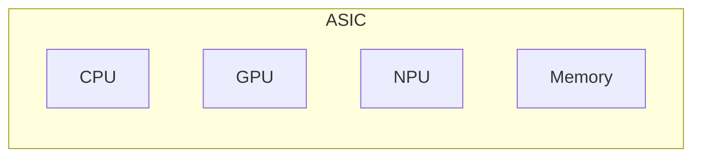

## 컴퓨팅 아키텍처의 개요


- AI 등 병렬처리와 연산 효율이 필요한 최적화된 칩 수요의 증가로 ASIC 기반의 SoC으로 발전
- FPGA: ==이종병렬성, 설계 유연성==
- ASIC: ==최고성능, 효율성==

## CPU, GPU, FPGA, ASIC 개념 및 특징, 적용분야

### CPU, GPU, FPGA, ASIC 개념 및 특징

#### CPU



- 복잡한 연산, 순차처리, 범용성

### GPU



- 단순한 연산, 병렬처리, ==소숫점 연산 특화/FPU==

#### FPGA



- ==설계 가능한 논리소자==, 회로
- 스위치를 주변으로 ==CLB==가 감싸고 있는 구조
- 목적별 재구성 가능, ==유연성==

#### ASIC



- 특화 반도체
- ==저전력, 고효율, 대량생산==

### CPU, GPU, FPGA, ASIC 적용분야

| 구분 | 분야 | 비고 |
| --- | --- | --- |
| CPU | 범용 컴퓨팅 | 웹브라우징, 오피스업무 |
| GPU | 그래픽 렌더링, 병렬처리 | 게임, 시뮬레이션, 머신 러닝 |
| FPGA | 맞춤형 H/W | ==디지털 회로 프로그래밍== |
| ASIC | ==특정 작업 최적화, 고성능== | 스마트폰, N/W 장치, AI가속기 |

## FPGA, ASIC 선택시 고려사항

```mermaid
xychart-beta
  x-axis "갯수" 1 --> 10
  y-axis "비용" 1 --> 10

  line "ASIC" [3, 3.25, 3.5, 3.75, 4, 4.25, 4.5]
  line "FPGA" [1, 2, 3, 4, 5, 6, 7]
```

- 대량생산시 ==비용 절충점을 고려==하여 ASIC 기반 SoC 도입 검토 필요
