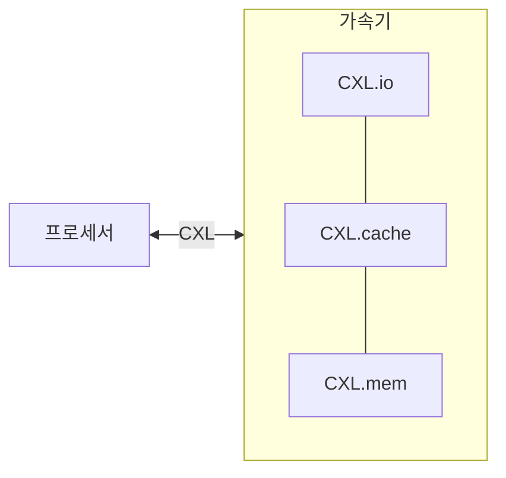

## CXL 개념

- 프로세서와 메모리 사이의 고속, 고용량 연결의 위한 개방형 표준 인터페이스
- PCIe 인터페이스의 메모리 일관성과 공유 기능 부족, 고성능, 저지연 데이터 전송과 메모리 일관성 제공, 효율성 향상

## CXL 구성도, 구성요소, 적용사례

### CXL 구성도

### CXL 구성요소

| 구분 | 내용 | 비고 |
| --- | --- | --- |
| CXL.io | 초기설정, 가상화, 장치 연결 등 입출력 프로토콜 | PCIe 호환 |
| CXL.cache | 메모리 캐시 일관성 제공, CPU와 가속기 간의 빠른 데이터 전송 가능 | 낮은 지연, 고속 전송, MESI 프로토콜 |
| CXL.mem | 메모리 공유 및 풀링 기능 제공, 여러 장치 간의 메모리 자원 공유 가능 | 고대역폭 메모리 접근, 메모리 풀링 |

### CXL 적용사례

| 구분 | 사례 | 비고 |
| --- | --- | --- |
| 데이터 센터 | 고성능 컴퓨팅, AI 가속기와 CPU 간의 고속 데이터 전송 | 높은 대역폭과 낮은 지연 시간 요구 환경 |
| 클라우드 서비스 | 클라우드 기반의 자원 효율적인 데이터 처리, 메모리 풀링을 통한 자원 공유 | 유연한 자원 할당 및 확장성 제공 |
| 스토리지 시스템 | 고속 NVMe SSD와 CPU 간의 데이터 전송 최적화 | 데이터 액세스 속도 향상, 스토리지 병목 현상 해결 |

## CXL 유형, PCIe 비교

### CXL 유형

| 구분 | 내용 | 비고 |
| --- | --- | --- |
| CXL Type 1 | 메모리 일관성 없이 I/O 가속기를 연결하여 고속 데이터 전송을 지원 | 단순 I/O 연결, 낮은 지연 시간 |
| CXL Type 2 | 메모리 일관성을 유지하며 CPU와 가속기 간의 데이터 전송을 지원  | CPU와 가속기 간의 일관성 유지 |
| CXL Type 3 | 메모리 풀링을 통해 여러 장치 간의 메모리 자원을 공유하고 관리 | 메모리 공유 및 풀링 기능 |

### CXL PCIe 비교

| 구분 | PCIe | CXL |
|---|---|---|
| 기능 | 데이터 전송, I/O 장치 연결 | 데이터 전송, 메모리 일관성, 메모리 공유 |
| 지연 시간 | 낮은 지연 시간 | 매우 낮은 지연 시간 |
| 호환성 | 다양한 I/O 장치와 호환 | PCIe와 호환되며, 추가 메모리 및 가속기와도 호환 |
| 메모리 일관성 | 없음 | 보장 |
| 메모리 공유 | 없음 | 메모리 풀링 및 자원 공유 가능 |
| 주요 사용처 | 일반적인 컴퓨터 및 서버의 I/O 장치 연결 | 데이터 센터, 고성능 컴퓨팅, 클라우드 컴퓨팅 |
| 버전 | PCIe 5.0 | CXL 3.0 |

## CXL 고려사항

- 다양한 벤더의 하드웨어 간의 호환성 확보 필요
