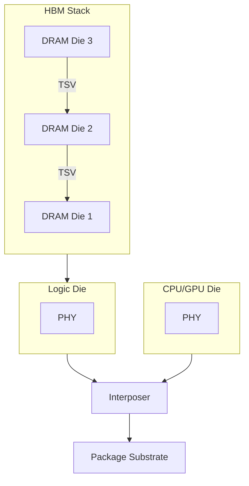

## HBM 개념

- 3D TSV 기술을 사용하여 여러 개의 DRAM 칩을 수직으로 쌓고, 초고속 인터커넥트를 통해 각 층을 연결함으로써 높은 대역폭과 낮은 전력 소비를 실현한 고대역폭 메모리
- 기존 DDR 램의 대역폭, 레이턴시의 한계와 AI 학습으로 대량 데이터 처리 수요 증가로 저전력 고속 연산 메모리 필요성 증가

## HBM 구성도, 구성요소, 비교

### HBM 구성도

- 수직 적층, TSV, 인터포저 등 기술을 통해 고성능 컴퓨팅 분야에서 핵심적인 역할을 하는 메모리 아키텍처

### HBM 구성요소

| 구분 | 기술요소 | 상세 설명 |
| --- | --- | --- |
| 메모리 적층 구조 |  TSV  |DRAM Die 를 뚫어 전도성 재료를 채운 수직 실리콘 관통 전극 |
| | DRAM Die | DRAM Cell 그룹, 패키징 단위 |
| | Logic Die | 다른 칩셋 및 PHY 와 DRAM die 연결 |
| 프로세스 유닛 | PHY | 물리계층 인터페이스, Logic Die - Process Die 간 연결 |
| | CPU/GPU | 그래픽, 명령어 처리 위한 프로세서 |
| 칩셋 | Silicon Interposer | Logic Die (CPU, GPU 등)와 HBM 칩 사이의 연결 |
| | Package Substrate | Silicon Interposer 과 그래픽카드 연결하는 PCB 기판 |

### HBM과 DDR6 비교

| 구분 | HBM | DDR6 |
| --- | --- | --- |
| 용도 | AI 학습용 | 그래픽 카드, AI 추론용 |
| Pin Data Rate | 6.4 Gbps | 16 Gbps |
| Pin | 1,024개 | 32개 |
| Bandwidth | 819 GB/s | 64 GB/s |
