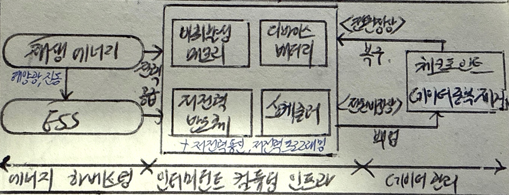

## 인터미턴트 컴퓨팅의 개념

- 전력 공급이 불안정한 환경에서 ==에너지 하베스팅==을 통해 컴퓨팅 작업을 지속적으로 수행하도록 하는 기술
- IoT 확산, 에너지 비용 절감, 안정성 향상, 에너지 제약환경, 연합학습

## 인터미턴트 컴퓨팅 개념도, 핵심요소, 기술 동향

### 인터미턴트 컴퓨팅 개념도

- 에너지 하베스팅을 통해 필요 전력 충전, 임계전력 이하인 경우 백업 후 재충전

### 인터미턴트 컴퓨팅 핵심요소

| 구분 | 핵심요소 | 설명 |
| --- | --- | --- |
| 에너지 하베스팅 | 태양광, 진동 | 환경에서 에너지를 수집하여 전력으로 변환 |
| | 배터리 | 에너지를 저장하여 지속적인 전력 공급 가능 |
| | 슈퍼캐패시터 | 빠른 충전과 방전이 가능하여 순간적인 전력 수요 충족 |
| 저전력 시스템 | 저전력 프로세서 | 낮은 소비 전력으로 연산을 수행하는 프로세서 |
| | 저전력 통신 | 에너지 소모를 최소화하는 무선 통신 방식 적용 (BLE, LoRa) |
| | 저전력 프로그래밍 | 에너지 절감을 위한 알고리즘 및 최적화 기법 적용 (Chain, Alpaca) |
| 데이터 관리 | 체크포인트 | 에너지 부족 시 데이터 손실을 방지하기 위한 상태 저장 |
| | 다중 버전 | 여러 버전의 데이터 사본 관리 및 버전 관리 |
| | 스케줄링 | 에너지 상태를 고려하여 연산 및 데이터 처리를 최적화 |

### 인터미턴트 컴퓨팅 기술 동향

| 구분 | 내용 | 비고 |
| --- | --- | --- |
| 국내 | - | - |
| 국외 | - | - |

## 인터미턴트 컴퓨팅 발전 방향

- 뉴로모픽 칩과 멤리스터 소자의 개발로 저장과 연산을 초저전력으로 처리하여 전력 공급 내성을 가질 것 으로 예상
