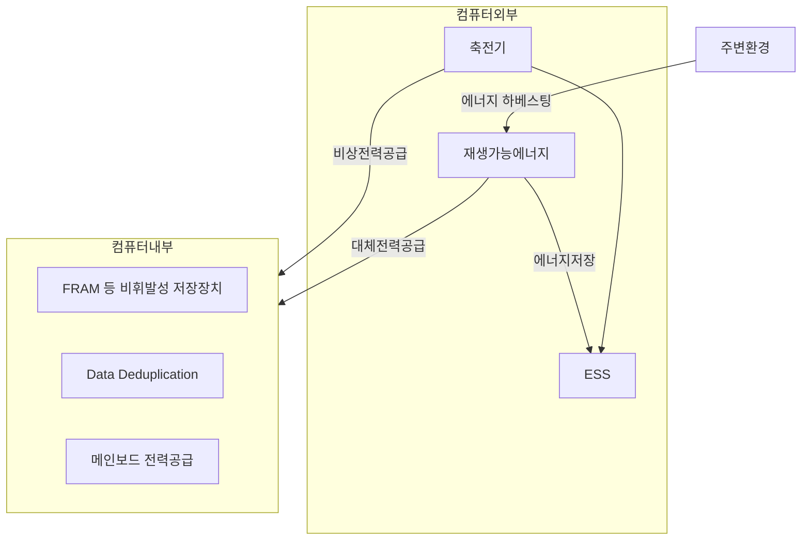

## 인터미턴트 컴퓨팅의 개념

- ==전원이 불안정하거나 간헐적으로 공급되는 환경==에서 컴퓨팅 시스템이 작업을 지속적으로 수행할 수 있도록 하는 기술
- IoT 확산, 에너지 비용 절감, 안정성 향상, 에너지 제약환경, AI 모델 학습 전력 사용량 증가

## 인터미턴트 컴퓨팅 개념도, 핵심요소, 기술 동향

### 인터미턴트 컴퓨팅 개념도

### 인터미턴트 컴퓨팅 핵심요소

| 구분 | 핵심요소 | 내용 |
| --- | --- | --- |
| 컴퓨터 내부 | ==FRAM== | 비휘발성 저전력 램 사용, 단전시 저장 바이트 복구 |
| - | Data Deduplication | 중복 데이터를 포인터로만 저장하여 실시간 백업 처리 |
| - | 메인보드 비상전력 공급 | 기존 5V 건전지 대체 파워시스템 구현 |
| 컴퓨터 외부 | 축전기 | 단전시 비상전력 가동 |
| - | 재생가능에너지 | 전력 소스를 다각화하여 재해복구성 확보 |
| - | ESS | 수집한 에너지를 저장하여 필요시 사용 |

### 인터미턴트 컴퓨팅 기술 동향

| 구분 | 내용 | 비고 |
| --- | --- | --- |
| 국내 | - | - |
| 국외 | - | - |

## 인터미턴트 컴퓨팅 발전 방향

- 뉴로모픽 칩과 멤리스터 소자의 개발로 저장과 연산을 초저전력으로 처리하여 전력 공급 내성을 가질 것 으로 예상
