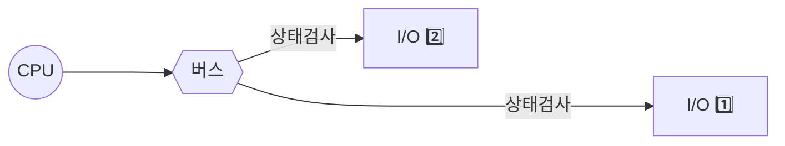
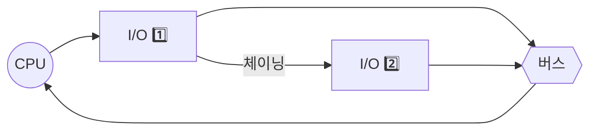
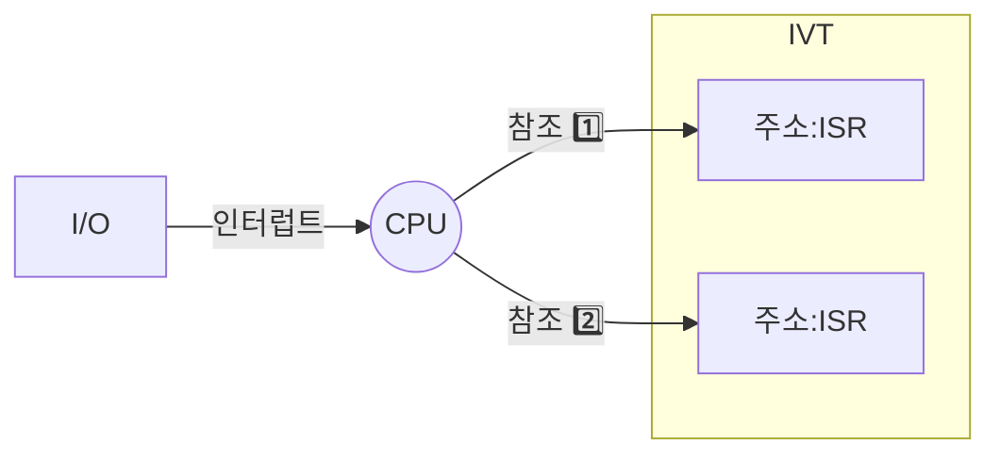

## 인터럽트의 개요

### 인터럽트 개념

- 컴퓨터 시스템 외부, 내부, SW적 원인으로 CPU에서 처리하던 프로그램을 중단하고 해당 동작을 처리할 수 있도록 보내는 제어신호
- 인터럽트는 SW/HW 방식으로 우선순위 판별을 통해 인터럽트 서비스 루틴 수행

### 인터럽트 유형

| 구분 | 방법 | 설명 |
|---|---|---|
| SW | Polling 방식 | 프로그램을 통해 장치 Flag에 의한 우선순위 검사 방식 |
| HW | Daisy-Chain 방식 | 우선순위 높은 장치를 물리적으로 상위에 배치하는 방식 |
| | Vector Interrupt 방식 | 고유한 번호를 부여하고 해당 번호에 대응하는 ISR 방식 |

## 폴링

### 폴링 개념

- SW적으로 CPU가 외부 장치의 상태를 지속적으로 검사하여 인터럽트 요청여부를 확인하는 방식

### 폴링 동작방식

| 구분 | 동작 방식 | 설명 |
|---|---|---|
| 초기화 및 확인 | 초기화 | CPU는 외부 장치와의 통신을 위한 인터럽트 관련 레지스터 및 플래그를 초기화 |
| | 장치 확인, 상태 확인 | CPU는 특정 외부 장치(예: 입출력 장치, 타이머 등)의 상태를 주기적으로 확인하기 위해 루프를 실행하며, 루프 내에서 특정 장치에 대한 상태를 확인 |
| | 인터럽트 여부 판단 | CPU는 장치의 상태를 확인한 후 인터럽트가 발생했는지 여부를 판단하며, 특정 플래그나 레지스터의 값을 확인하여 인터럽트 여부를 판단 |
| 처리 | 인터럽트 처리 | 인터럽트가 발생한 경우, CPU는 해당 인터럽트에 대한 처리를 위해 인터럽트 서비스 루틴을 실행 |
| | 루프 반복 | 처리가 완료되면 CPU는 다시 루프를 시작하여 다음 인터럽트가 발생했는지를 확인하고 처리 |

## 데이지 체인

### 데이지 체인 개념

- CPU와 가까운 장치가 우선순위가 높게 처리되고, 하나의 인터럽트가 다음 인터럽트를 호출하는 직렬 연계 방식

### 데이지 체인 동작방식

| 구분 | 동작 방식 | 설명 |
|---|---|---|
| 발생 및 우선순위 전달 | 인터럽트 발생 및 신호 전달 | 외부 장치에서 인터럽트가 발생하고, 인터럽트 신호가 체인의 시작점에 있는 인터럽트 컨트롤러에게 전달 |
| | 우선순위 확인 및 결정 | 체인 내의 각 인터럽트 컨트롤러는 자신의 우선순위를 확인하고, 처리할 인터럽트를 결정 |
| 처리 및 전달 | 인터럽트 처리 | 우선순위가 가장 높은 인터럽트 컨트롤러는 해당 인터럽트를 처리하고, 서비스 루틴을 실행 |
| | 인터럽트 전달 | 처리가 완료된 인터럽트는 다음 인터럽트 컨트롤러로 전달되며, 다음 우선순위가 높은 인터럽트를 처리 |
| 완료 및 대기 | 인터럽트 처리 반복 | 처리가 완료되면 다음 인터럽트 컨트롤러로 넘어가며, 이 과정을 반복 |
| | 우선순위 갱신 및 대기 | 모든 인터럽트가 처리되면 인터럽트 컨트롤러들은 우선순위를 다시 확인하고 새로운 인터럽트를 대기 |

## 벡터 인터럽트

### 벡터 인터럽트 개념

- 각 인터럽트를 참조하는 인터럽트 벡터 테이블을 관리, 고유 벡터 주소로 서브루틴을 실행하는 방식

### 벡터 인터럽트 동작방식

| 구분 | 동작 방식 | 설명 |
|---|---|---|
| 인터럽트 발생 및 동작 | 인터럽트 발생 | 외부 장치에서 인터럽트가 발생 |
| | 인터럽트 컨트롤러 동작 | 인터럽트 컨트롤러는 발생한 인터럽트를 CPU에 알리고 해당 인터럽트의 번호(인터럽트 벡터)를 제공 |
| 확인 및 처리 | 인터럽트 벡터 확인 | CPU는 인터럽트 컨트롤러로부터 받은 인터럽트 벡터를 이용하여 인터럽트 서비스 루틴의 주소를 확인 |
| | 인터럽트 서비스 루틴 실행 | CPU는 찾아낸 인터럽트 서비스 루틴의 주소로 점프하여 해당 인터럽트를 처리 |
| | 인터럽트 서비스 루틴 종료 | 인터럽트 서비스 루틴의 실행이 완료되었음을 CPU가 인식 |
| 복귀 | 프로그램 복귀 | 인터럽트 서비스 루틴 실행 후, CPU는 원래의 프로그램 또는 작업으로 돌아가 수행을 계속 진행 |

## 인터럽트 유형 비교

| 구분 | 폴링 | 데이지체인 | 벡터인터럽트 |
| --- | --- | --- | --- |
| 개념 | CPU가 주기적으로 장치 상태를 확인하여 인터럽트를 처리하는 방식 | 인터럽트 신호가 장치 간 체인을 따라 전달되며, 우선순위가 높은 장치가 처리되는 방식 | 각 장치가 고유의 인터럽트 벡터를 가지며, 벡터를 통해 해당 장치를 즉시 처리하는 방식 |
| 방식 | SW | HW | HW |
| 속도 | 느림 | 중간, 체인 길이에 따른 지연 | 빠름, 벡터 주소로 즉시 처리 |
| 장점 | 구현 간단, 추가 HW 불필요 | 단일 인터럽트 라인으로 여러 장치 처리 가능 | 빠른 속도, 유연한 우선순위 |
| | 단순한 시스템에 효율적 | 우선순위 제어 용이 | 복잡한 시스템에서 효율적 |
| 단점 | CPU 자원 소모, 성능 저하 | 체인 길이가 길어질 시 병목 발생 | 구현 복잡, 추가 HW 비용 |
| | 느린 반응 속도 | 장치 추가 시 체인 구조 변경 필요 | 벡터 테이블 구성/관리 비용 |
