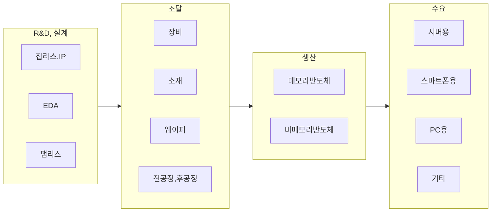

## 메모리 반도체, 비메모리 반도체 개념

- 메모리 반도체: 저장방식에 따라 ==휘발성 RAM==, ==비휘발성 ROM==으로 구분되는 정보를 저장하기 위한 반도체
- 비메모리 반도체: CPU, AP, 센서 등의 정보를 연산하고 처리하기 위한 ==시스템 반도체==
- 메모리 반도체는 ==단순구조로 저가==, 비메모리 반도체는 ==복잡한 설계가 필요하여 고가== 형성

## 메모리 반도체, 비메모리 반도체 비교

### 기술적 요소 비교

| 구분 | 메모리 | 비메모리 |
| --- | --- | --- |
| 설계복잡도 | 낮음 | 높음 |
| 집적도 | 높음 | 낮음 |
| 주요성능지표 | ==용량, 속도, 전력소비== | ==연산 성능, 전력효율, 기능== |
| 주요기술 | ==셀 구조== | ==트랜지스터== |
| 제품 | DRAM, SRAM, NAND | CPU, GPU, AP, NPU |

### 관리적 요소 비교

| 구분 | 메모리 | 비메모리 |
| --- | --- | --- |
| 생산방식 | 소품종 대량생산 | 다품종 소량생산 |
| 시장구조 | 범용시장 | 특화시장 |
| 생산구조 | 설계업체가 대부분 생산 | 대부분 설계, 양산 분리 |
| 변동성 | 높음 | 낮음 |
| 주요업체 | 삼성, 하이닉스 | 인텔, 엔비디아 |

## 반도체 가치사슬

### 반도체 가치사슬 구성도

### 반도체 가치사슬 세부 구성요소

| 구분 | 내용 | 주요 기업 |
| --- | --- | --- |
| ==R&D, 설계== | 반도체 기능 정의, 회로설계, 제품 및 제조공정 연구 | 인텔, 삼성전자, 엔비디아, 퀄컴 |
| ==조달== | 반도체에 필요한 장비 및 소재 공급 | ASML 등 |
| ==생산== | 웨이퍼 생산, 패키징, 테스트 등의 과정을 통한 칩 생산 | TSMC, 삼성전자, 하이닉스 |
| ==수요== | 생산된 반도체를 사용하는 시장 | 애플, 삼성전자 등 |

## 반도체 산업 발전방향

- 비전
  - 기술 리더쉽 확보
  - 시장 다각화
  - 생태계 구축
- 전략
  - R&D 투자 강화
  - 글로벌 파트너쉽
