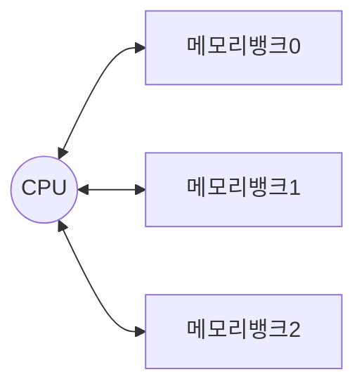
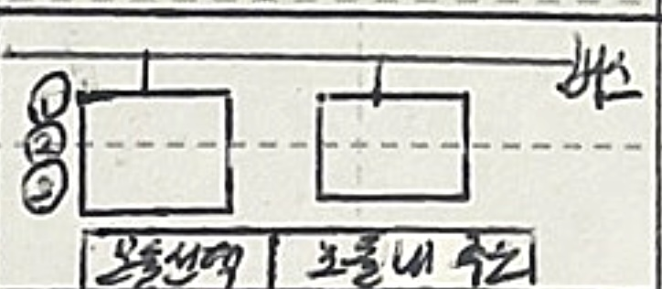
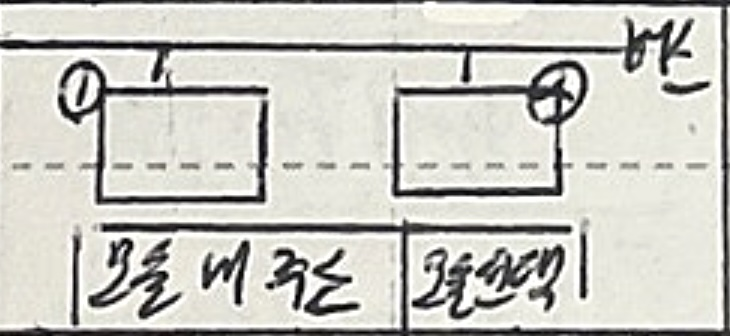
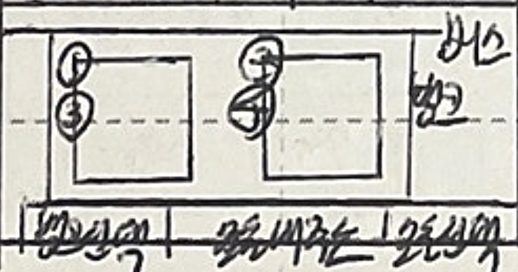
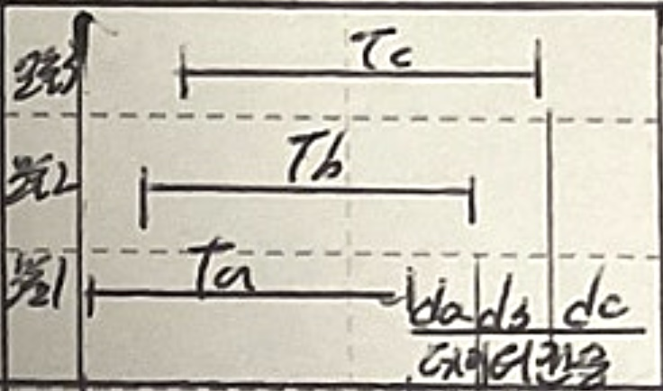
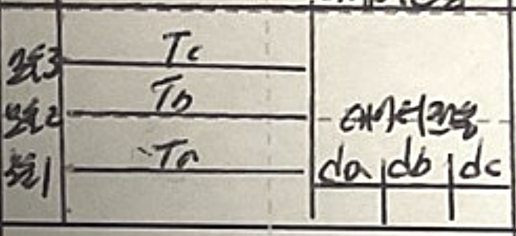

## 메모리 인터리빙의 개념

- 메모리 ==접근시간을 최소화==하기 위해 ==메모리를 복수개의 모듈로== 나누고, 각 모듈에 ==연속적인 주소를 부여==하여 ==동시에 접근==이 가능하게 하는 기법
- 버스의 경합이나 기억장치의 ==충돌 회피== 가능

## 메모리 인터리빙의 개념도, 유형, 액세스방식

### 메모리 인터리빙의 개념도

- 뱅크0 접근, 뱅크0 읽기 및 뱅크1 접근 순으로 병렬 접근

### 메모리 인터리빙의 유형

| 구분 | 개념도 | 내용 |
| --- | --- | --- |
| ==상위 인터리빙== |  | 주소의 상위비트로 모듈 선택, ==순차적, 에러시 하나의 모듈 영향== |
| ==하위 인터리빙== |  | 주소의 하위비트로 모듈 선택, ==다수의 모듈 동시 접근, 에러 전파== |
| ==혼합 인터리빙== |  | ==모듈을 뱅크로 그룹화==, 뱅크 선택시 상위 인터리빙, 뱅크 내 모듈 선택시 하위 인터리빙 |

### 인터리빙의 액세스 방식

| 구분 | 개념도 | 내용 |
| --- | --- | --- |
| ==C-Access, 순차접근== |  | 주소가 버스를 통해 순차적으로 모듈에 도착, ==버스 경합 발생가능== |
| ==S-Access, 병렬접근== |  | ==읽기 동시 진행, 데이터 순차 전송==하여 ==동시성 확보==로 높은 성능, ==DDR DRAM 적용== |

## 인터리빙 고려사항

- 메모리 ==접근 패턴==, 시스템 성능 요구사항, 비용, 복잡도 등을 고려하여 최적의 인터리빙 방식 선택
