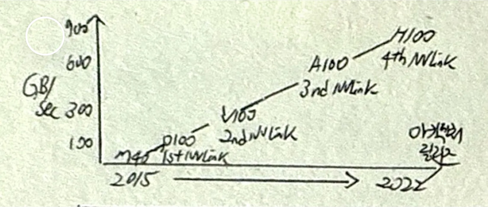
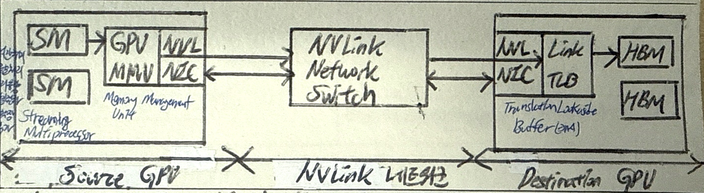

## 멀티 GPU 개요

- 딥러닝에서 대규모 신경망을 효율적으로 학습하기 위해 GPU 활용, 다수 GPU를 연결하기 위한 인터커넥트 기술 발전으로 멀티 GPU 필요성 증가

## 멀티 GPU 구성도, 핵심요소, 장점

### 멀티 GPU 구성도

- 여러 개의 GPU를 동시에 사용하여 대규모 신경망 학습 및 추론 훈련

### 멀티 GPU 핵심요소

| 구분 | 역할 | 설명 |
|---|---|---|
| SM (Streaming Multiprocessor) | 연산 처리 유닛 | GPU 내부에서 병렬 연산을 수행하는 핵심 유닛으로, 작업을 처리하고 메모리 관리 유닛으로 데이터를 전달 |
| MMU (Memory Management Unit) | 메모리 관리 | GPU의 메모리 액세스를 관리하고 가상 메모리 주소를 물리 메모리 주소로 변환 |
| NVLink NIC | 데이터 전송 인터페이스 | NVLink를 통해 GPU 간의 고속 데이터 전송을 담당 |
| NVLink Network Switch | 데이터 전송 경로 관리 | 여러 GPU 간 데이터 흐름을 관리하고, 최적의 전송 경로를 설정 |
| TLB (Translation Lookaside Buffer) | 주소 변환 캐싱 | MMU에서 자주 사용하는 주소 변환 결과를 캐싱하여 속도 향상 |
| HBM (High Bandwidth Memory) | 고속 메모리 | 고속 메모리로 데이터 저장 및 접근을 지원, GPU 연산 속도 최적화 |

### 멀티 GPU 장점

| 구분 | 장점 | 설명 |
| --- | --- | --- |
| 성능향상 | 실시간 처리 | 멀티 GPU를 통해 연산 작업을 병렬로 처리하여 실시간 성능을 향상시킴 |
| | 대규모 처리 | 대규모 데이터 세트나 복잡한 모델을 빠르게 학습 및 추론 가능 |
| 자원최적화 | 메모리 용량 | 각 GPU의 메모리를 활용하여 단일 GPU의 메모리 제한을 극복 |
| | 모델 병렬화 | 모델을 여러 GPU로 분산하여 병렬 연산을 최적화 |
| 확장성 | GPU 확장 | 추가 GPU를 연결하여 시스템의 연산 성능을 손쉽게 확장 가능 |
| | 데이터 추가 | 대규모 데이터 처리 시 여러 GPU를 활용하여 병렬 데이터 전처리 및 학습 가능 |

## 멀티 GPU 학습 환경 구축시 고려사항

| 구분 | 고려사항 | 비고 |
| --- | --- | --- |
| 물리적 인프라 | HW구성 | GPU 선택, 서버, CPU, 파워, 냉각시스템 |
| | NW구성 | 내부연결, 서버 간 ㅇ녀결, 로드밸런싱, 스토리지 네트워크 |
| 논리적 시스템 | SW환경 | OS, 프레임워크, 분산훈련, 모니터링 도구 |
| | 성능최적화 | GPU 메모리 관리, 연산정밀도, 배치 크기, 하이퍼파라미터 튜닝 |
| | 병렬처리 환경 | 데이터 병렬화, 파이프라인 병렬화, 모델 병렬화 |

- TIA-942 데이터센터 구축을 위한 표준 요구사항을 참조하여 비용효율성과 가용성 제고
