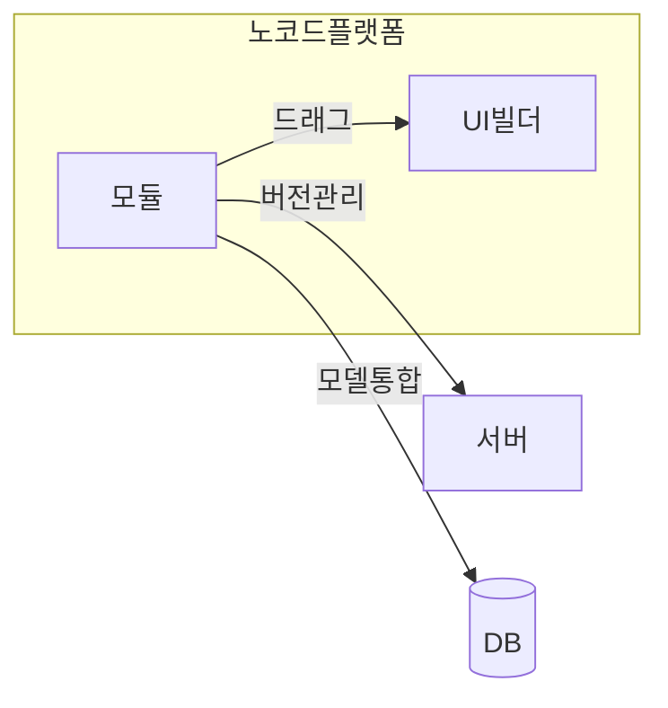

## 노코드 개념

- 프로그래밍 지식 없이 UI와 드래그 앤 드랍 기능 등을 활용하여 SW를 개발할 수 있도록하는 플랫폼 또는 도구
- 개발 속도 향상으로 인한 비용절감과 비전문가도 어플리케이션을 개발할 수 있는 접근성 향상

## 노코드 구성도, 구성요소, 적용방안

### 노코드 구성도

### 노코드 구성요소

| 구분 | 내용 | 비고 |
| --- | --- | --- |
| 사용자 인터페이스 | 시각적으로 어플리케이션 또는 워크플로우 조작 | 드래그 앤 드랍 |
| 모듈 | 사전 구성된 기능 모듈 | 재사용 가능 |
| 버전관리 | 다중 사용자 환경 구축 | 문서 버저닝 |
| 데이터 모델 통합 | 기능과 비지니스 로직, 데이터 모델 통합 | API, 데이터 제어 |

### 노코드 적용방안

| 구분 | 내용 | 비고 |
| --- | --- | --- |
| 공공 | 코딩 없는 SW 개발 교육 | 생산성 향상 |
| 금융 | 데이터 분석 도구 시각화 | 대쉬보드 사용성 |
| 민간 | 빠른 프로토타이핑, 시장 출시 | 효율성, 비용절감 |

## 노코드 사용시 고려사항

- 커스터마이징이 필요한 경우, Low-code 플랫폼이나 전통적 코딩 방식으로 어플리케이션 구현 필요.
