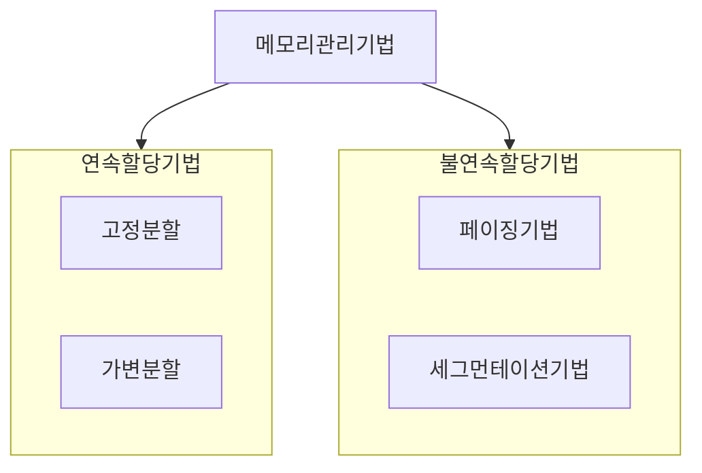
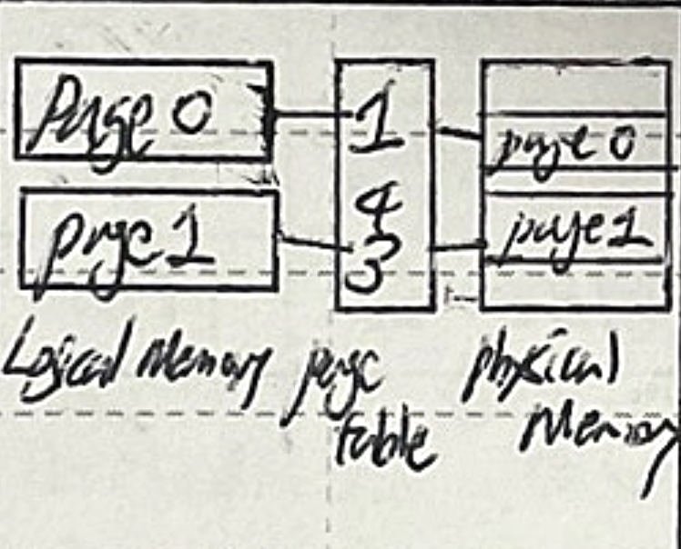
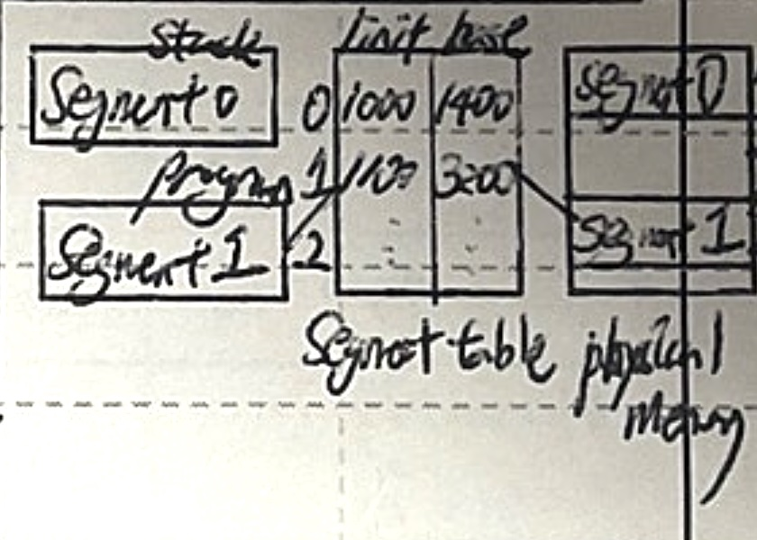
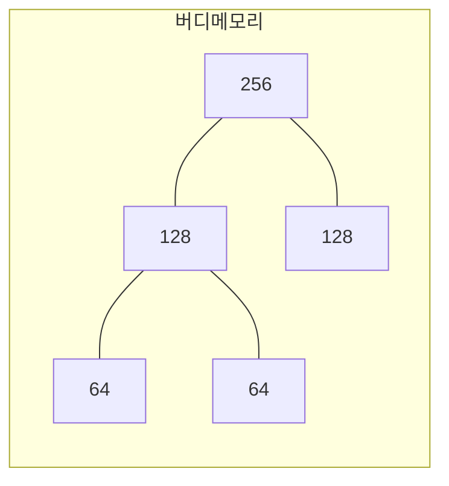
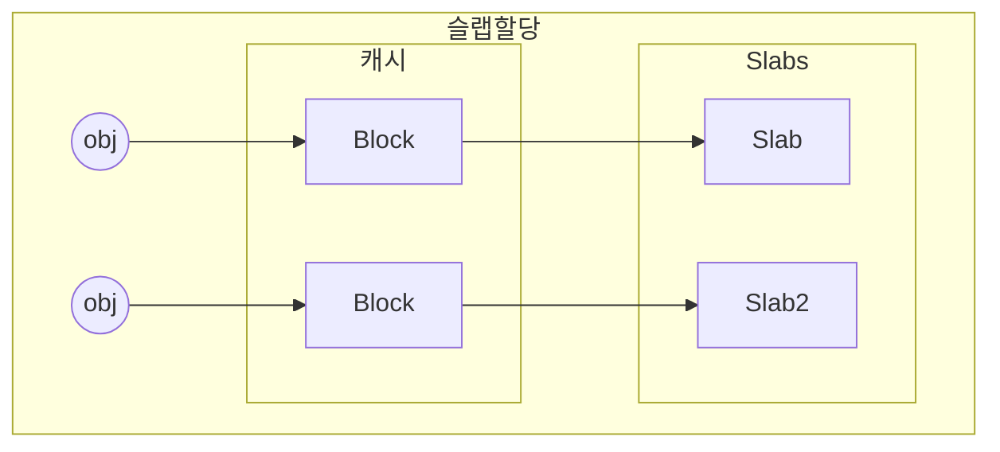

## 메모리 관리 기법의 개념

- 제한된 메모리 리소스를 효율적으로 사용하기 위해 메모리 관리 기법 필요

## 페이징 기법, 세그먼테이션 기법 개념, 핵심요소

### 페이징 기법, 세그먼테이션 기법 개념

| 구분 | 페이징 | 세그먼테이션 |
| --- | --- | --- |
| 개념도 |  |  |
| 개념 | 동일한 크기의 페이지 단위로 메모리를 나누고 주소를 매핑 | 프로그램의 논리적 구성(코드, 데이터 등)에 따라 가변 길이의 세그먼트로 메모리를 관리 |

- 페이징 기법은 동일한 크기로, 세그먼테이션 기법은 가변크기로 분할

### 페이징 기법, 세그먼테이션 기법 핵심요소

| 구분 | 페이징 | 세그먼테이션 |
| --- | --- | --- |
| 단위크기 | 고정, 페이지 | 가변, 세그먼트 |
| 외부단편화 | 없음 | 있음 |
| 내부단편화 | 있음 | 없음 |
| 주소사상 | 페이지테이블 | 세그먼트테이블 |
| 복잡성 | 단순 | 주소, 사이즈 관리 복잡 |
| 프로세스 간 공유 | 어려움  |용이 |
| 교체시간 | 짧은 | 느림 |

- 페이징 기법의 메모리 관리 효율성, 세그먼테이션 기법의 논리적 메모리 관리 이점을 결합한 페이지드 세그먼테이션 기법 사용

### 페이지드 세그먼테이션 기법

- 파일 관리는 세그먼트 단위로, 프로그램 조각은 페이지 단위로 관리

## 단편화 해결 기법

### 외부 단편화 해결 기법

- 버디 메모리: 메모리를 2의 거듭제곱으로 나눈 뒤 필요시 블록을 나눠서 할당, 반환된 블록을 병합하여 더 큰 블록 생성
- Best Fit

### 내부 단편화 해결 기법

- 세그먼테이션
- 슬랩 할당: 미리 정해진 크기의 슬랩 단위로 메모리 할당, 각 슬랩은 특정 객체의 캐시로 사용

## 메모리 관리 기법 선택시 고려사항

- 외부단편화와 내부단편화를 줄이기 위해 버디메모리, 슬랩할당자 기법 사용 고려
- 스레싱이 발생하지 않게 적절한 테이블 크기 설정
