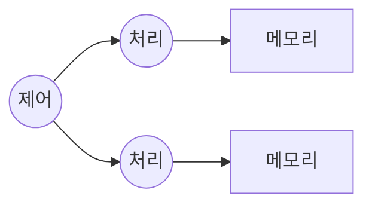
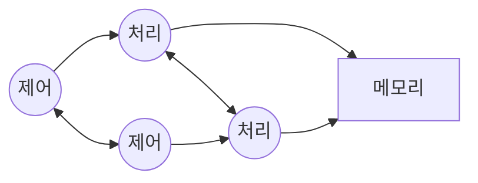
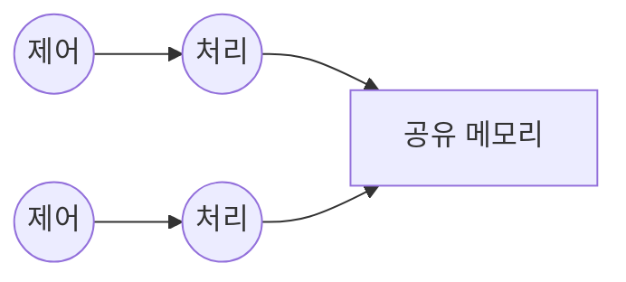
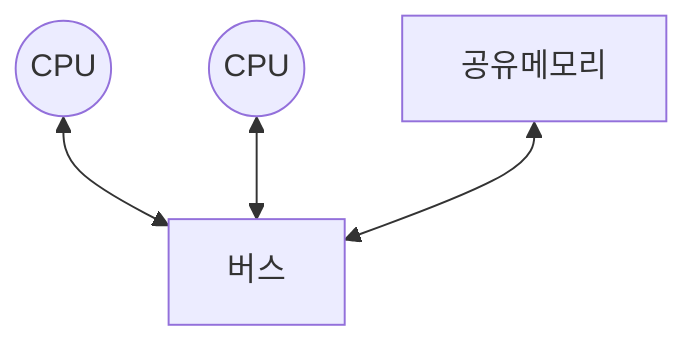
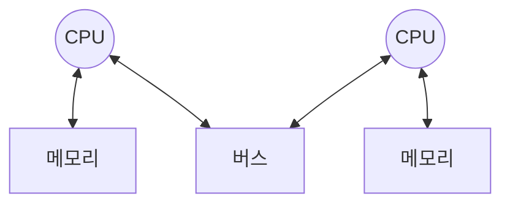
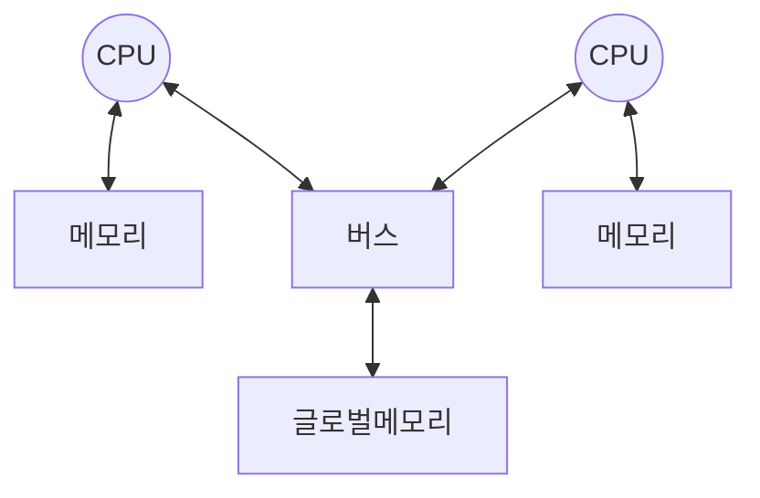

## 병렬 컴퓨팅 개념

- 프로그램 내 계싼 영역을 여러 개로 나누어 각 계산을 여러 프로세서에서 동시 수행하는 기술
- 생성형 AI 발전, GPU 품귀, 단일 프로세서 한계

## 병렬 컴퓨팅 특징

| 구분 | 특징 | 설명 |
|---|---|---|
| 목적 | 실행시간 단축 | Wall clock time 단축 |
| - | 작업 동시 수행 | HW, SW 측면 작업 분할 |
| 유형 | 작업 단위 병렬성 | 다수 독립 작업 프로그램 |
| - | 태스크 단위 병렬성 | 서로 다른 기능 태스크 |
| - | 스레드 단위 병렬성 | 동시 처리 스레드 |
| - | 명령어 단위 병렬성 | 어셈블리 명령어 |

## 병렬 프로세서의 분류

### Flynn의 분류

#### SISD

- 명령어 순차처리
- 단일 프로세서 시스템

#### SIMD

- 하나의 제어 유닛으로 동기화
- 벡터, 행렬 연산 처리

#### MISD

- 프로세서 처리 결과로 연산 수행
- 실제 구현 불가

#### MIMD

- 각 프로세서가 비동기적 처리
- 강결합시 공유메모리 사용
- 약결합시 분산메모리와 메시지 패싱 기법 사용

### 시스템 구성 방법에 따른 분류

#### SMP

- 프로그래밍 용이
- 메모리 접근 병목

#### MPP

- 프로그래밍 복잡
- 낮은 가용성

#### NUMA

- 장점 결합
- 분산 로컬 메모리, 글로벌 메모리 사용
- 다양한 프로세서 사용 가능
