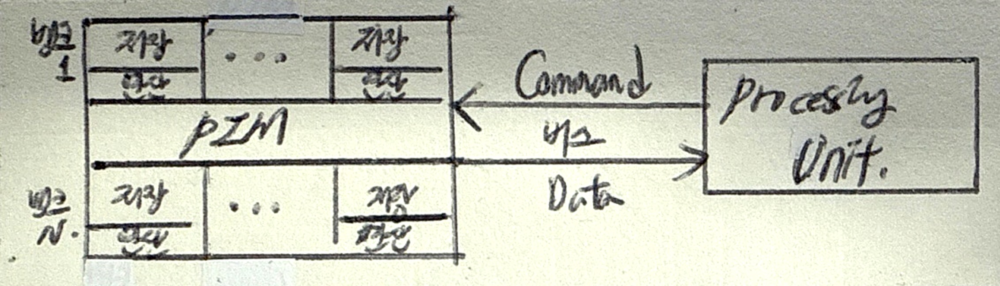

## PIM 개념

- 메모리 내부 연산 기능을 추가하여, 데이터 이동 없이 메모리 자체 연산 수행으로 성능 개선 및 에너지 효율을 높이는 메모리 반도체
- 폰 논이만 구조 한계 극복, 추론 AI 패러다임, 데이터 병목 최소화, 저전력 설계

## PIM 개념도, PNM과의 비교, 적용방안

### PIM 개념도

### PIM, PNM 비교

| 구분 | PIM | PNM |
| --- | --- | --- |
| 연산기 위치 | DRAM 칩 내부 | DRAM 근처 별도 칩 |
| 전송지연 | 없음 | 일부 있음 |
| 장점 | 데이터 이동 제거 | 범용성 확보 |
| | 병렬처리 극대화 | 전력효율성 |
| 단점 | 범용성 낮음 | 상대적 낮은 성능 |
| 분야 | 추론 AI 등 | 고성능컴퓨팅, 데이터센터 |

### PIM 적용바안

| 구분 | 내용 | 비고 |
| --- | --- | --- |
| AI 가속기 | AI 작업의 대규모 병렬 처리시 활용 | 음성인식, 이미지 처리 |
| 빅데이터 분석 | 대량 데이터 실시간 처리 최적화 | SEM, EPM 등 |
| 고성능 컴퓨팅 | GPU와 협업하여 워크로드 분산 | MAC 연산 수행 |
