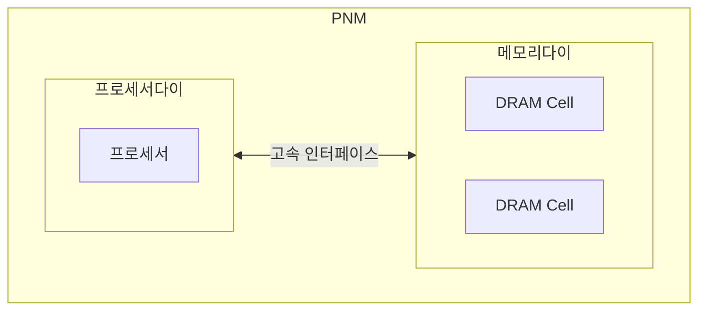

## PNM의 개념

- 메모리와 프로세서를 다이 차원에서 가깝게 연결하여 별도의 논리연산을 수행하는 메모리
- 메모리 접근을 위한 병목 최소화, 대역폭 최대화 가능

## PNM의 구성도, 구성요소, 적용방안

### PNM의 구성도

### PNM의 구성요소

| 구분 | 내용 | 비고 |
| --- | --- | --- |
| 프로세서  |연산처리 담당 중앙처리장치 | 데이터 처리 |
| 고속 인터페이스 | 메모리와 프로세서 간 통신 속도 향상 | CXL 등 |
| DRAM Cell | 대용향 휘발성 기억 장치 | 데이터 저장 |
| 다이 | 회로가 제작된 공간 | 직접회로 연결 |

- 다이 접합과 인터페이스 통합으로 제작이 가능하기에 기존 프로세서 사용 용이

### PNM 활용방안

| 구분 | 내용 | 비고 |
| --- | --- | --- |
| 데이터 집중형 앱 | 데이터 접근 빈도가 높은 어플리케이션 적용 | 빅데이터 분석, LLM 등 |
| 실시간 처리 앱 | 실시간 데이터 처리가 필요한 슈퍼컴퓨팅에 활용 | 금융모델, 기상 예보 등 |
| 전력효율 필요 앱 | 높은 전성비를 유지해야하는 환경 | 모바일, 임베디드시스템 등 |

## PNM 고려사항

- CPU와 PNM간 메모리 데이터 저장시 경합을 고려한 SW개발 필요
