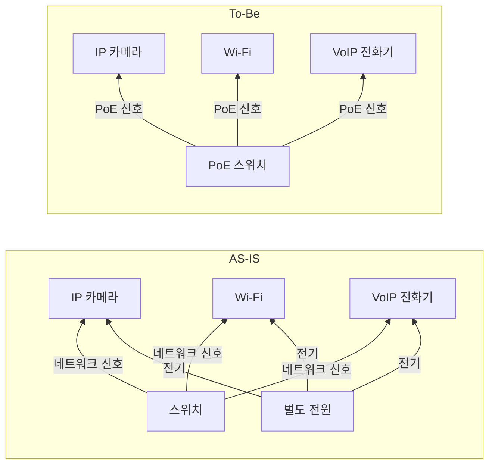

## PoE 개념

- 하나의 이더넷 케이블을 통해 데이터와 전력을 동시에 공급할 수 있는 기술
- 전력 케이블이 없으므로 간편한 설치, 유연한 배치 가능, PoE 스위치를 통한 중앙 집중 전력 관리

## PoE 구성도, 구성요소, 적용방안

### PoE 구성도

### PoE 구성요소

| 구분 | 내용 | 비고 |
|---|---|---|
| PSE (Power Sourcing Equipment) | 전력을 공급하는 장비 | PoE 스위치, PoE 인젝터 |
| PD (Powered Device) | 전력을 받는 장비 | IP 카메라, 무선 AP, VoIP 전화기 등 |

### PoE 적용방안

| 구분 | 내용 | 비고 |
|---|---|---|
| VoIP 전화기 | PoE를 통해 전원 공급 및 네트워크 연결 | 설치 간소화 및 비용 절감 |
| 무선 액세스 포인트 | PoE로 전력 및 데이터 공급 | 위치 유연성 증가 |
| IP 카메라 | PoE로 전력 및 데이터 공급 | 보안 시스템 구축 용이 |

## PoE 기술 표준

### PoE IEEE 국제 표준

| 구분 | 내용 | 비고 |
|---|---|---|
| IEEE 802.3af | 최대 15.4W 전력 공급 | 기본적인 IP 전화기 및 무선 AP에 적합 |
| IEEE 802.3at (PoE+) | 최대 25.5W 전력 공급 | 고성능 IP 카메라 및 고급 VoIP 전화기 지원 |
| IEEE 802.3bt (PoE++) Type 3 | 최대 60W 전력 공급 | PTZ 카메라 및 멀티채널 무선 AP에 적합 |
| IEEE 802.3bt (PoE++) Type 4 | 최대 100W 전력 공급 | 디지털 사이니지 및 고성능 장비에 적합 |

### PoE IEEE 국내 표준

| 구분 | 내용 | 비고 |
|---|---|---|
| 전파법 | 전자파 적합성 인증 필요 | 전자파 간섭 방지 |
| 전기통신기술기준 | 네트워크 장비의 안전성과 성능 규정 | 전력 공급 관련 안전성 기준 |
| KS C IEC 60950 | 정보기기 안전성 표준 | 과전압, 과전류 보호 장치 포함 |

## PoE 고려사항

- PoE 네트워크 구축 시 각 장비의 전력 소모량을 고려하여 총 전력 예산 관리 필요
