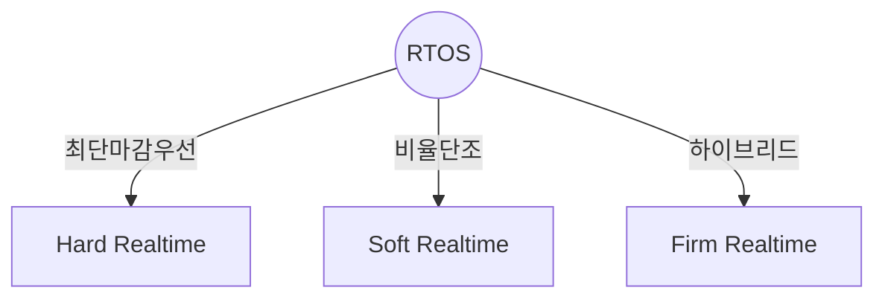
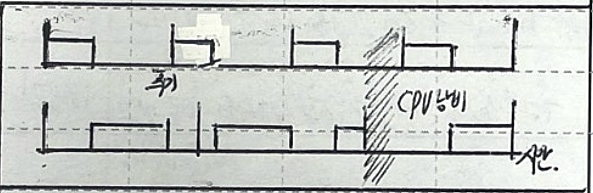
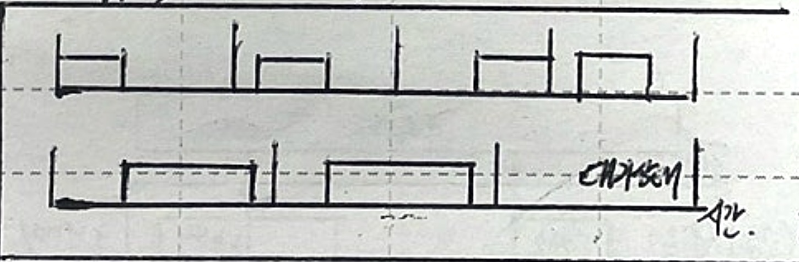
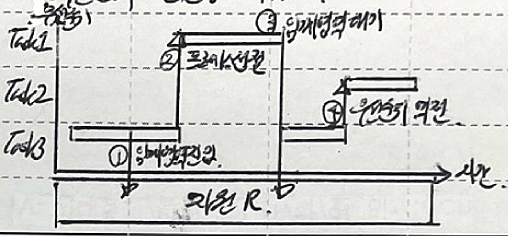
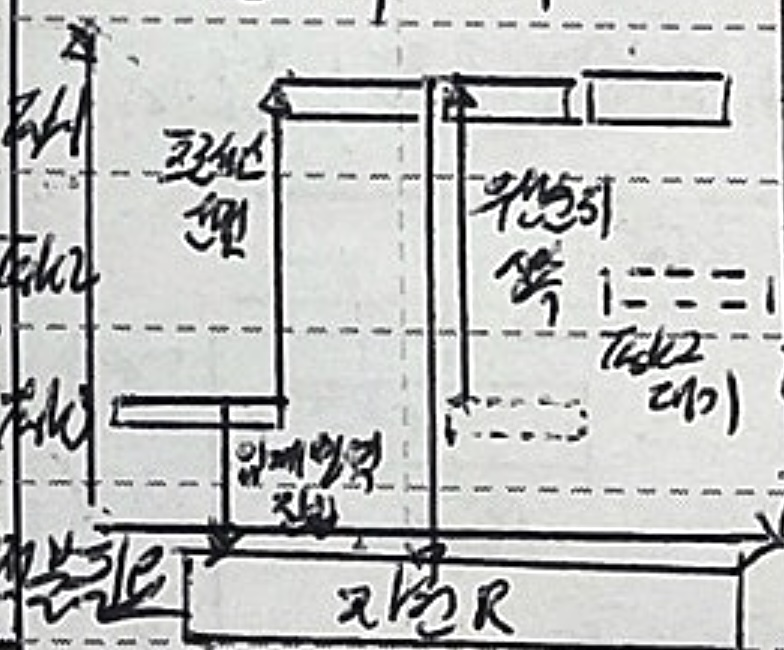
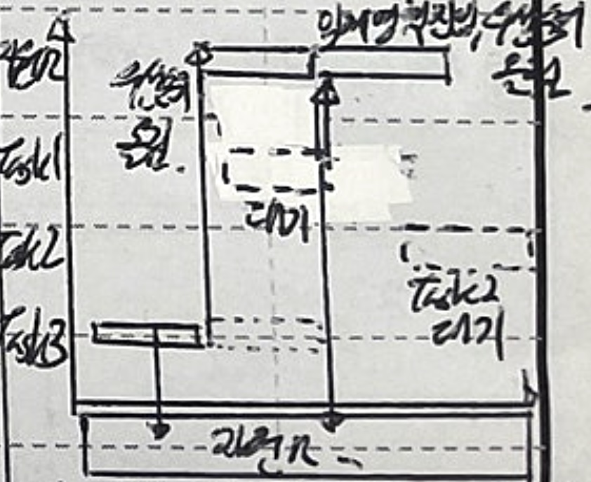

## Realtime Scheduling의 개념

- 실시간 스케쥴링은 특정 태스크가 주어진 데드라인 내에 완료되도록 프로세싱을 보장하는 스케줄링 방법
- 시스템 제약 만족, 예측 가능성, 응답성, Mission Critical 프로세스 처리

## 우선순위 기반 스케줄링 기법

### RM, Rate Monotonic

> 비율 단조

- 태스크의 주기가 짧을 수록 높은 우선순위로 스케줄링
- 스케줄링 예상 가능, 단순 구현, 고정 우선순위, 제한적 CPU 활용, Soft RTOS

### EDF, Earliest Deadline First

> 최단 마감시간 우선

- 태스크의 데드라인이 가까울 수록 높은 우선순위로 스케줄링
- 스케줄링 예상 어려움, 높은 CPU 활용, 동적 우선순위, 효율적, Hard RTOS
- 주기가 짧거나 데드라인이 긴 태스크가 공유 자원을 선점하는 경우 우선순위 역전현상 발생

## 우선순위 역전현상 개념 및 세부 절차

### 우선순위 역전현상 개념도

### 우선순위 역전현상 세부 절차

| 순번 | 절차 | 내용 |
| --- | --- | --- |
| 1 | 임계영역 진입 | Task3은 자원R 사용 위해 진입 |
| 2 | 프로세스 선점 | 높은 우선순위의 Task1은 Task3의 임계영역 선점 스케줄링 실행 |
| 3 | 임계영역 대기 | Task3이 진입 중이므로, Task1은 대기 |
| 4 | 우선순위 역전 | 중간 우선순위의 Task2가 선점하여 스케줄링, Task1은 계속 대기 |

## 우선순위 역전현상 해결방안

### 우선순위 상속

- 임계영역에 진입한 낮은 우선순위 태스크의 우선순위를 진입 대기하는 높은 우선순위 태스크와 동일하게 부여

### 우선순위 올림

- 임계영역 자원R에 가장 높은 우선순위를 부여하고, 임계영역 진입 태스크의 우선순위를 자원의 우선순위로 올림
