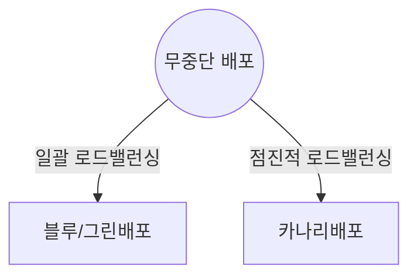
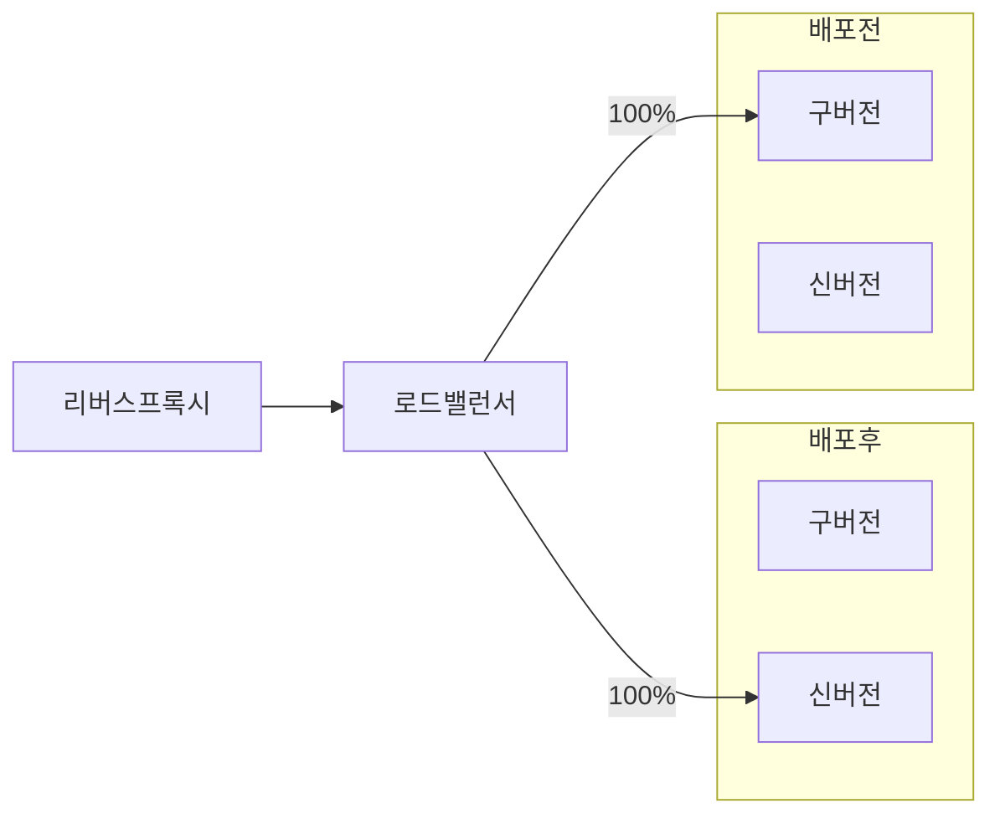
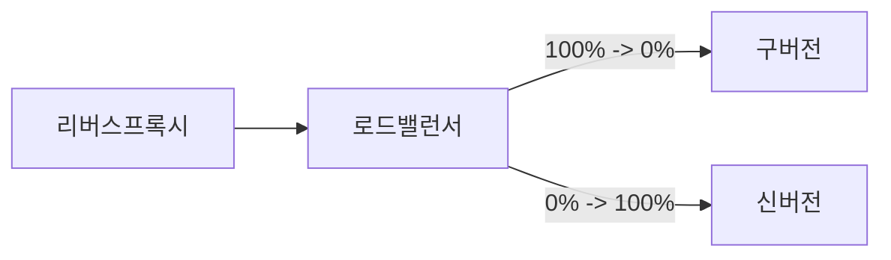
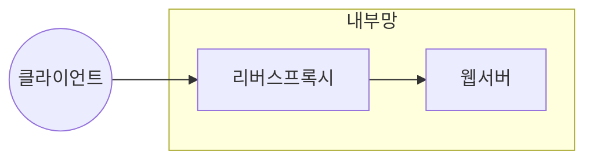
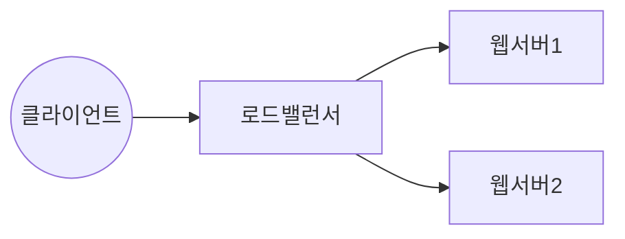

## 무중단 배포의 개념

- 유저에게 서비스 중단 없이 새로운 버전의 서비스를 배포하는 것을 목표로 하는 배포 전략
- 신규 버전 배포시 리스크 최소화, 빠른 롤백, 클라우드 컴퓨팅, 가상화 기술 발전으로 무중단 배포 활용

## 블루/그린 배포, 카나리 배포의 개념도, 핵심 요소, 세부 절차

### 블루/그린 배포, 카나리 배포의 개념도

- 신버전을 모두 배포하고 트래픽을 일괄 전환하여 배포

- 신버전에 점진적으로 트래픽을 늘려 위험을 감지하고 대응하여 배포

### 블루/그린 배포, 카나리 배포 핵심요소 비교

| 구분 | 블루/그린 | 카나리 |
| --- | --- | --- |
| 목적 | 신규버전 트래픽 일괄 전환 | 신규버전 점진적 배포 |
| 리스크 | 모든 사용자가 신규버전 즉시 사용 | 리스크 최소화 |
| 복잡도 | 일괄전환으로 간단 | 비율 조정으로 복잡 |
| 테스트 범위 | 모든 사용자가 새 버전 테스트 | 초기 소규모 사용자만 테스트 |
| 배포 시간 | 단시간 | 상대적 장시간 |

### 블루/그린 배포, 카나리 배포 세부 절차

| 구분 | 블루/그린 | 카나리 |
| --- | --- | --- |
| 준비단계 | 신규버전 배포, 테스트 | 카나리 환경 준비 초기 테스트 |
| 배포 방식 | 전체 트래픽 일괄 전환 | 소규모 트래픽에서 점진적 전환 |
| 모니터링 | 전환 후 트래픽 모니터링 | 점진적 모니터링 오류확인 |
| 롤백 | 문제시 전체 롤백 | 필요시 특정 비율 롤백 |

## 리버스 프록시와 로드밸런서 비교

### 리버스 프록시, 로드밸런서 개념도

- 클라이언트 요청을 내부 서버로 전달하고 서버의 응답을 반환하는 중계 서버
- 리버스 프록시는 L7 로드밸런서의 기능도 일부 수행

- 트래픽을 여러 서버에 분산하여 부하를 관리하는 장치 또는 SW

### 로드밸런서의 구성요소

| 구분 | 요소 | 내용 |
| --- | --- | --- |
| 유형 | L4 로드밸런서 | 네트워크 계층이나 전송계층 정보로 부하 분산 |
| | L7 로드밸런서 | 응용 계층에서 헤더, 쿠키 등 요청 기반 정보로 부하 분산 |
| 알고리즘 | Round Robin | 순차, 순환, 응답시간 빠르고 구성이 간편 |
| | Least Connection | 백엔드 서버 중 활성화 된 연결 계산, 가장 적은 커넥션을 가진 서버로 로드 밸런싱 |
| | Response Time | 가장 빠른 응답 시간을 제공하는 서버로 로드 밸런싱 |
| | Hashing | TCP/UDP 연결시 각 클라이언트에 대한 해시 생성하여 동일 서버 연결, 세션 유지 가능 |
