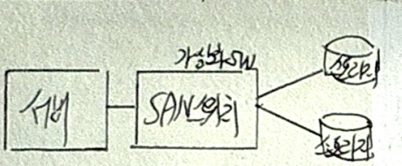
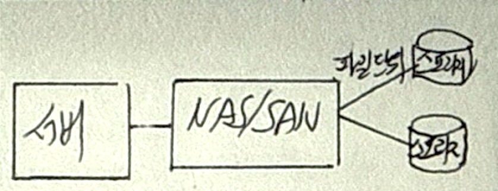
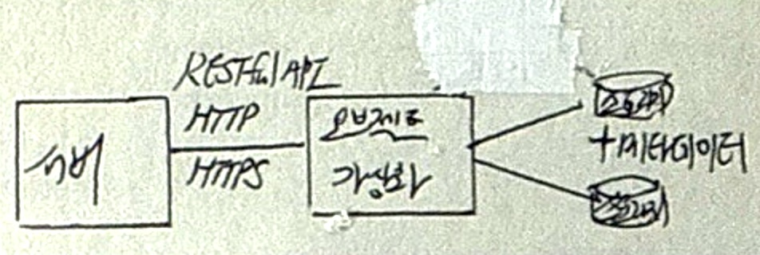

## 스토리지 가상화 개념

- 물리적으로 분리된 다수 스토리지를 논리적으로 통합하여 스토리지 자원의 가용성과 편리성을 향상시키는 기술
- 기존스토리지 낮은 활용도(48%) 극복, 벤더 종속적인 이기종 스토리지 호환성 문제, 유지보수 비용 절감

## 스토리지 가상화 유형

| 구분 | 블록스토리지 가상화 | 파일스토리지 가상화 | 오브젝트스토리지 가상화 |
| --- | --- | --- | --- |
| 개념도 |  |  |  |
| 개념 | 물리적 스토리지를 블록 단위로 추상화하여 논리적 블록으로 제공 | 물리적 스토리지를 파일단위로 추상화하여 파일명, 경로 통해 공유 | 데이터를 개체 단위로 관리하여 데이터와 메타데이터를 함께 저장하고 논리적 통합하여 제공 |
| 주요환경 | SAN | NAS/SAN | 클라우드 스토리지, 대규모 비정형데이터 저장소 |
| 접근방식 | OS가 논리적 블록주소 통해 접근 | 파일명, 경로 | RESTful API, HTTP, HTTPS |
| 프로토콜 | iSCSI, FC | NFC, SMB, CIFS | S3API, HTTP, HTTPS |
| 주요사례 | DB, 고성능 어플리케이션, 가상머신디스크 | 파일공유, NW기반 데이터 접근 | 클라우드스토리지, 데이터분석, 비정형데이터 저장 |
| 특징 | 낮은 오버헤드, 빠른 데이터 전송, OS 무관 | 액세스제어 용이, 속성정보 관리 편이 | 오브젝트별 고유 ID, OS/FS 의존성 없음, 무한 확장성 |
| 대표기술 | SANique, IBM SVC, 스토리지 어레이 | NFS, GPFS, SNFS, GFS | S3, Cloud Storage, Blob Storage |

## 스토리지 가상화 구축시 고려사항

| 항목 | 고려사항 | 설명 |
|---|---|---|
| 호환성 | 지원 프로토콜 및 솔루션 | DBMS, HA 솔루션, 백업 장치 지원 가능 FC 프로토콜, iSCSI 프로토콜, CIFS & NFS 지원 |
| 가용성/안정성 | 장애 대응 및 데이터 보호 | Failover 기능 지원 및 데이터 유실 방지 바이러스 및 기타 공격 차단 |
| 기능성 | 서비스 연속성 및 확장성 | 무중단 서비스 및 스토리지 추가/제거 디스크 볼륨 할당 및 확장 작업 가능 |
| 구축용이성 | 시스템 다운타임 최소화 | 기존 시스템과의 호환성 고려 다운타임 최소화 방안 제시 |
