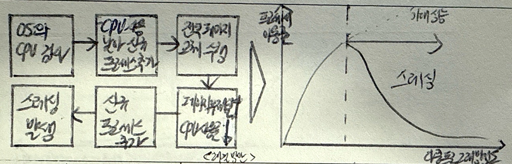
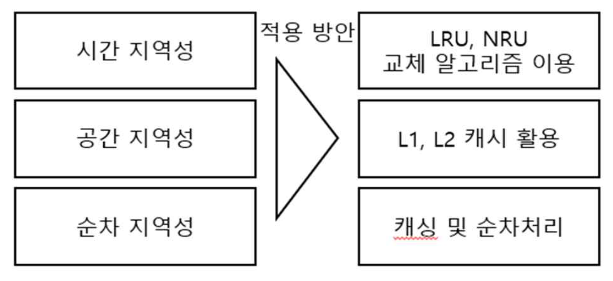
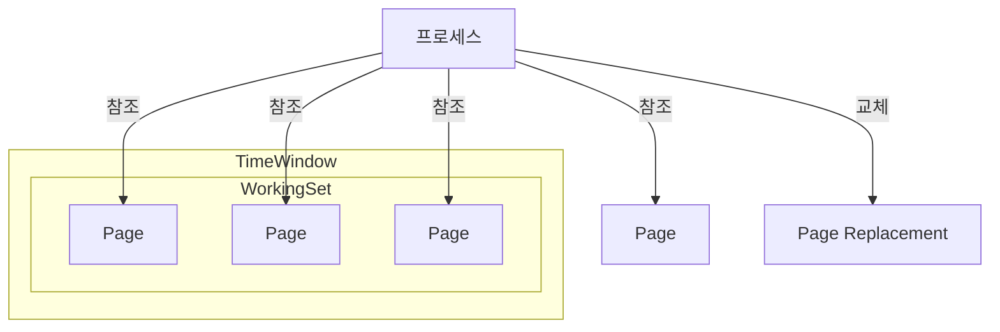
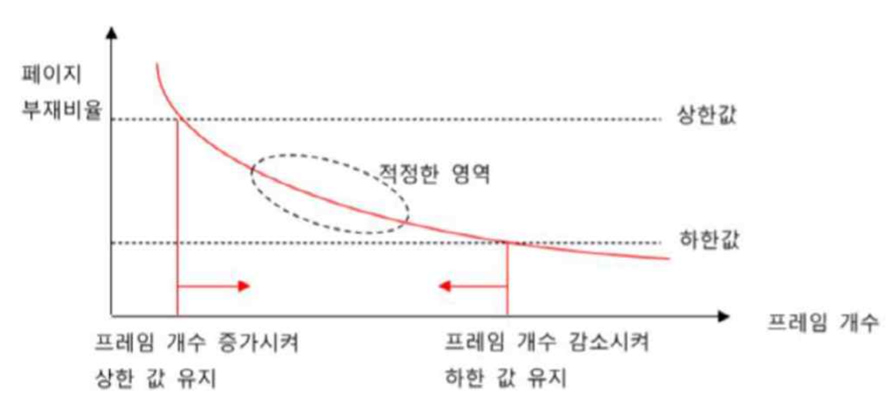

## 스레싱의 개념

- ==멀티프로세싱 환경==에서 ==빈번한 페이지 교체==로 실제 프로세스 실행보다 페이지 교체에 더 많은 시간을 소요하여 ==프로세스 성능이 낮아지는 이상현상==

## 프로세스 스레싱의 개념도, 원인, 해결방안

### 프로세스 스레싱의 개념도

- 다중 프로그래밍의 정도가 높아짐에 따라 프로세서 이용률이 향상되며 임계치 도달 후 프로세서 이용률이 낮아짐

### 프로세스 스레싱의 원인

| 구분 | 원인 | 내용 |
| --- | --- | --- |
| 하드웨어 | 저사양 CPU | CPU 코어부족, 속도 부족 |
| | 메모리 용량 부족 | 용량 부족으로 인한 가상메모리 사용 증가 |
| 알고리즘 | 지역성 미고려 | 페이지 교체 정책 효율성 저하 |
| | 페이지 빈도 미고려 | 부적절한 페이지 교체 알고리즘 사용 |
| 프로세스 | 프로세서의 이용률 감시/운영/추가 | 낮은 이용률에 신규 프로세스 도입 |
| | 최소 페이지 프레임 불만족 | 프로세스 요구로 페이지 폴트 발생 |
| | 페이징으로 인해 Ready Queue Empty | CPU 이용률 감소 |
| | CPU 스케쥴러의 다중프로그래밍 정도 증가 | 신규 프로세스 추가 |
| | 신규프로세스의 기존 프로세스 페이지 탈취 | 페이지 폴트 발생 |

- Working Set Model, Page Fault Frequency 기버을 통해 발생을 최소화하는 것이 최선의 방법

### 프로세스 스레싱 해결방안

#### 지역성 모델

- 시간지역성: 페이지 프레임 교체 알고리즘 조정으로 개선
- 공간 지역성: L1, L2 캐시 활용 통한 캐시 적중률 향상
- CPU 하드웨어 아키텍처 활용을 통한 순차처리, 파이프라이닝 적용

#### 워킹셋 모델

- 프로세스가 자주 참조하는 ==페이지 집합을 메모리에 상주==시켜 교체 감소

#### 페이지부재빈도 모델

- ==페이지 부재율==의 ==상한, 하한==을 정하여 직접 페이지 부재율을 ==예측==하여 ==프레임 할당, 프레임 회수==하여 페이지 교체 감소

## 스레싱 발생시 고려사항

- 자주 사용하는 프로세스에 높은 우선순위를 부여하여 중요 작업이 원활히 수행 가능하도록 처리
- 정적 검사(힙 덤프), 동적 검사(JMX 등 모니터링)
