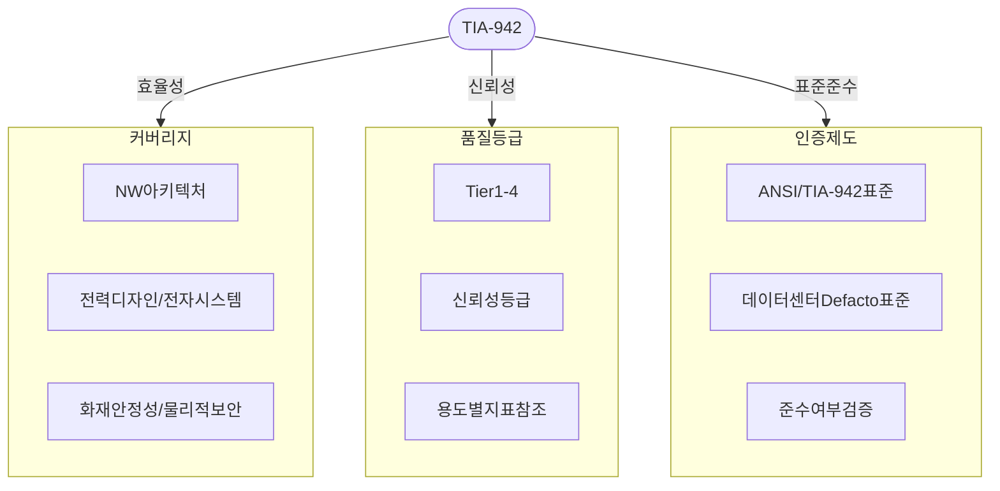
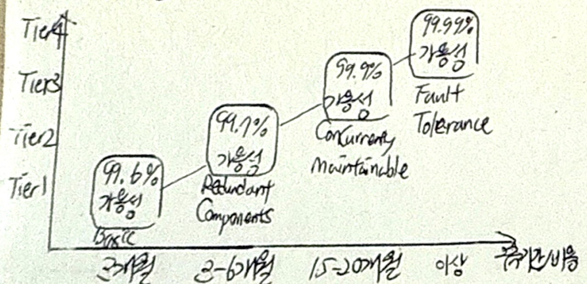

## TIA-942 개념

- 미 통신산업협회가 제정한 데이터센터 설계 및 운영에 필요한 최소 요건을 규정한 데이터 센터 인프라의 Defacto 표준
- 데이터센터 안정성, 신뢰성, 확장성, 보안지침 제공, 데이터센터 품질 평가기준

## TIA-942 구성도, 품질등급

### TIA-942 구성도

### TIA-942 품질등급 개념도

### TIA-942 품질등급 상세설명

| 구분 | Tier1 | Tier2 | Tier3 | Tier4 |
| --- | --- | --- | --- | --- |
| 장애영향 | 비/계획된 액티비티에 대한 사이트 영향 높음 | 비/계획된 액티비티에 대한 사이트 영향 보통 | 계획된 액티비티에 대한 컴퓨팅 HW 운영지장 없음 | 계획된 액티비티에 대한 임계부하 없음 |
| | | | 비계획 작업은 영향 | 비계획 액티비티 임계부하 적어도 1번 방어 |
| 전력/냉방시설 이중화 | 필요 | N+1 | N+1, 동시 활성화 | 2(N+1), 무정지상태 |
| 백본/라우터 이중화 | 없음 | 없음 | 필요 | 필요 |
| 적용기간 | 3개월 | ~6개월 | 15~20개월 | 15~20개월 |
| MTTR | 28.8h | 22.0h | 1.6h | 0.4h |
| 보안시설 | 일반 잠금장치 | 카드인식 | 생체인식 | 생체인식 |
