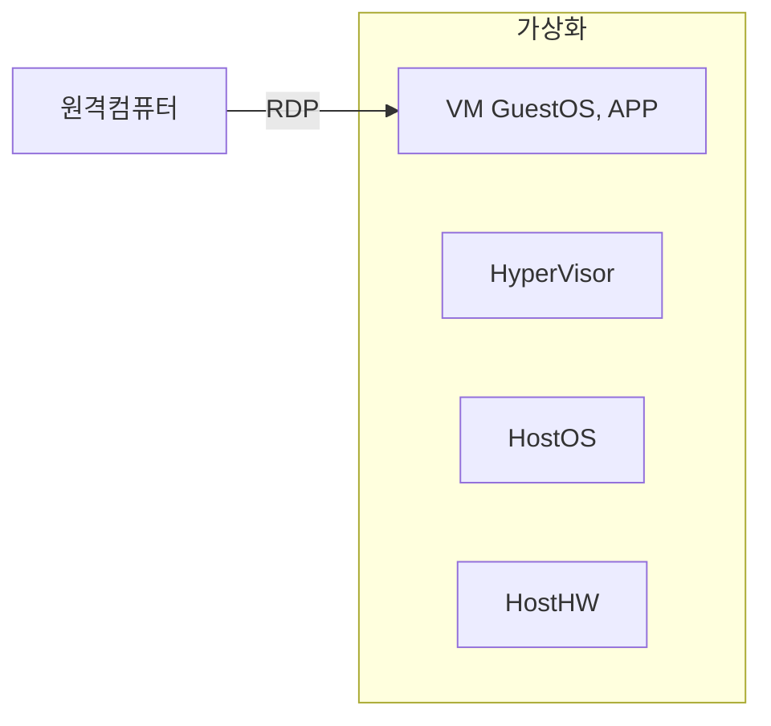
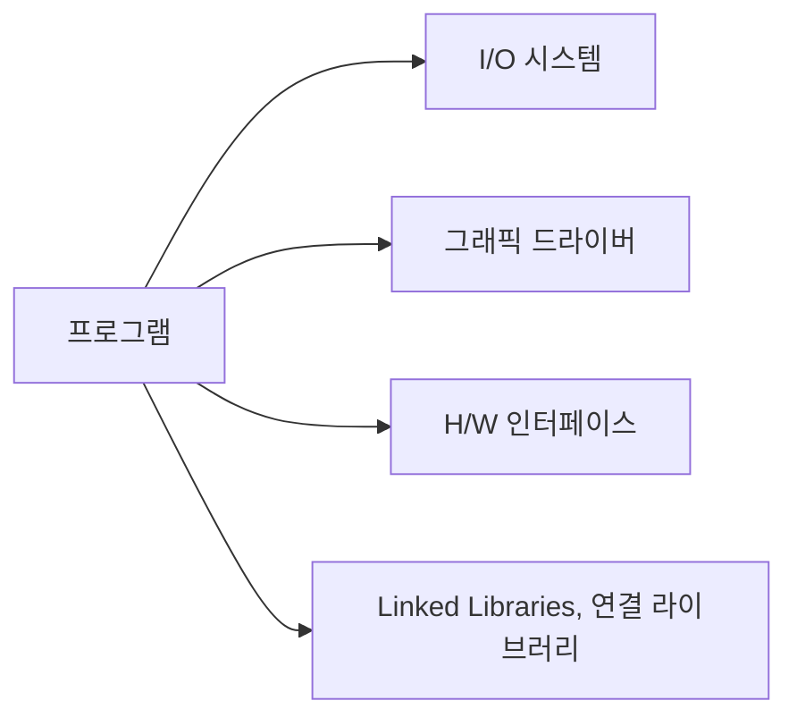
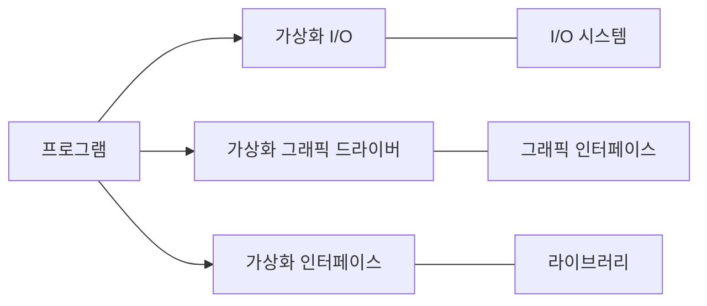

## 가상화의 개념

- Host 하드웨어에서 Hypervisor 기반 가상화된 하드웨어에 GuestOS를 설치하고, 원격데스크탑 프로토콜로 접근하여 원격지에서 GUI로 GuestApp 사용
- 재택근무, 글로벌 비지니스 요구의 증가로 가상화 기술, RDP 활용 증가, 어디서나 업무 자원에 접근 가능한 유연성 제공

## 가상화의 동작 방식

### 일반적인 운영체제에서의 프로그램 동작방식

- 프로그램이 OS API, Lib를 호출하는 방식

### 응용프로그램 가상화 동작방식

- 어플리케이션은 에뮬레이트된 인터페이스를 호출하는 방식

## 원격 데스크탑 프로토콜

### 원격 데스크탑 프로토콜의 개념

- 네트워크를 통해 다른 컴퓨터에 ==원격으로 접속하고 제어==할 수 있게 해주는 프로토콜
- 화면공유, 입력 전달, 파일 및 오디오 전송 등의 기능 담당

### 원격 데스크탑 프로토콜의 유형

| 운영체제 | 프로토콜 | 내용 |
| --- | --- | --- |
| Windows | RDP | MS사 프로토콜, N/W 부하가 적고, 빠른 응답성 |
| MacOS | ARD | Apple사 프로토콜, 원격 관리기능 제공 |
| Unix, Linux | X11 | X윈도우 시스템 프로토콜, N/W로 다른 시스템 GUI 제어 |
| 기타 | VNC | 오픈소스 프로토콜, 다양한 운영체제 지원 |

## 원격 가상화 환경의 발전방향

- 클라우드 컴퓨팅 기술의 발전으로 가상화된 데스크탑 환경을 제공해주는 DaaS 서비스로 발전
- OS 선택의 유연성과 ==샌드박싱==으로 인한 보안성 확보하여 기업 내 다양한 업무 환경, 테스트 환경 지원.
