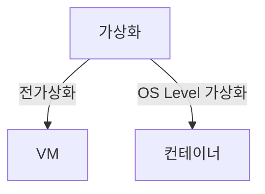
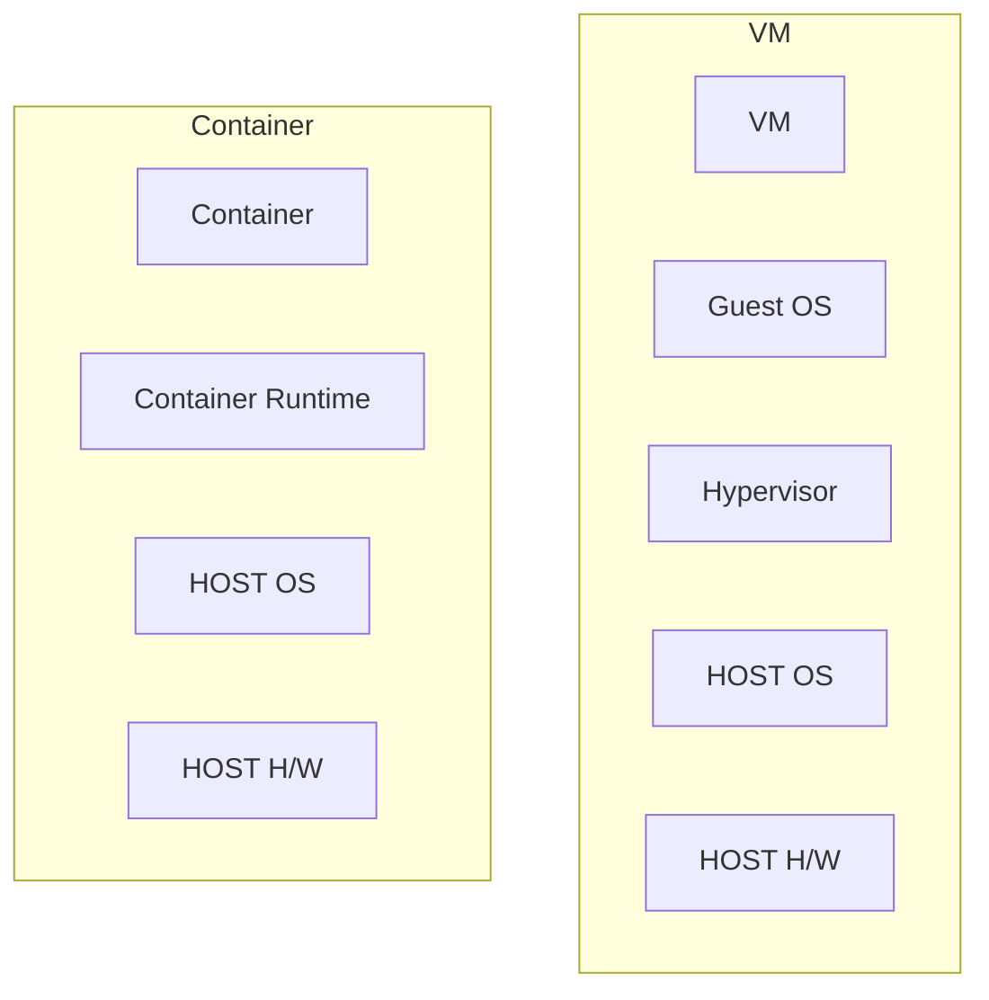

## 가상화의 개념

- 물리적인 자원들을 논리적으로 표현해 효율적으로 사용하고 관리하기 위한 기술
- 클라우드 전환으로 자원활용률, 보안성, 확장성 높은 가상화 기술로 서버 제공, ==논리적 투명성==으로 사용자는 물리적 자원의 세부사항 미고려

## VM, Container의 개념도, 핵심요소, 적용방안

### VM, Container 개념도

- VM: ==하이퍼바이저==를 통해 물리자원을 추상화한 ==Guest OS기반== 가상화
- Container: ==Host OS 커널== 통해 격리된 컨테이너를 제공하는 가상화

### VM, Container 핵심요소 비교

| 구분 | VM | Container |
| --- | --- | --- |
| 핵심기술 | 하이퍼바이저, VM스냅샷 | 컨테이너, 네임스페이스, CGROUP |
| 환경 | 다양한 OS지원, 독점적 자원할당 | 단일 OS지원, 호스트OS커널 공유 |
| 장점 | 강한 보안성, 장애 격리, 다양한 OS 실행 | 빠른 부트시간, 이미지 경량화, 자원사용 효율성 |
| 단점 | 높은 자원 소모, OS 라이센스 비용 | 커널 공유로 인한 낮은 보안성, 호스트OS 종속성 |

### VM, Container 적용방안

| 구분 | VM | Container |
| --- | --- | --- |
| 보안 및 격리 | 높은 보안성과 격리성이 필요한 경우 | 프로세스 수준 격리와 빠른 복구가 필요한 경우 |
| CI/CD | DevOps환경에서 다양한 운영체제 테스트 시나리오 자동화 | IaC 기반, GitOps의 지속적 통합, 배포 |
| 적합 환경 | 기존, 레거시, 모놀리스 | 클라우드 네이티브 |

## 가상화시 고려사항

- 이미지, 스냅샷 레지스트리 관리와 보안 스캐닝을 통해 취약점 사전 조치 필요
