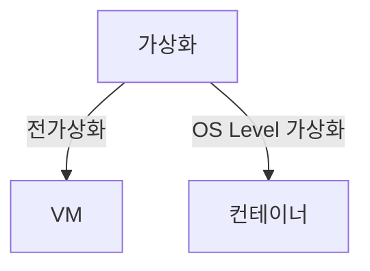
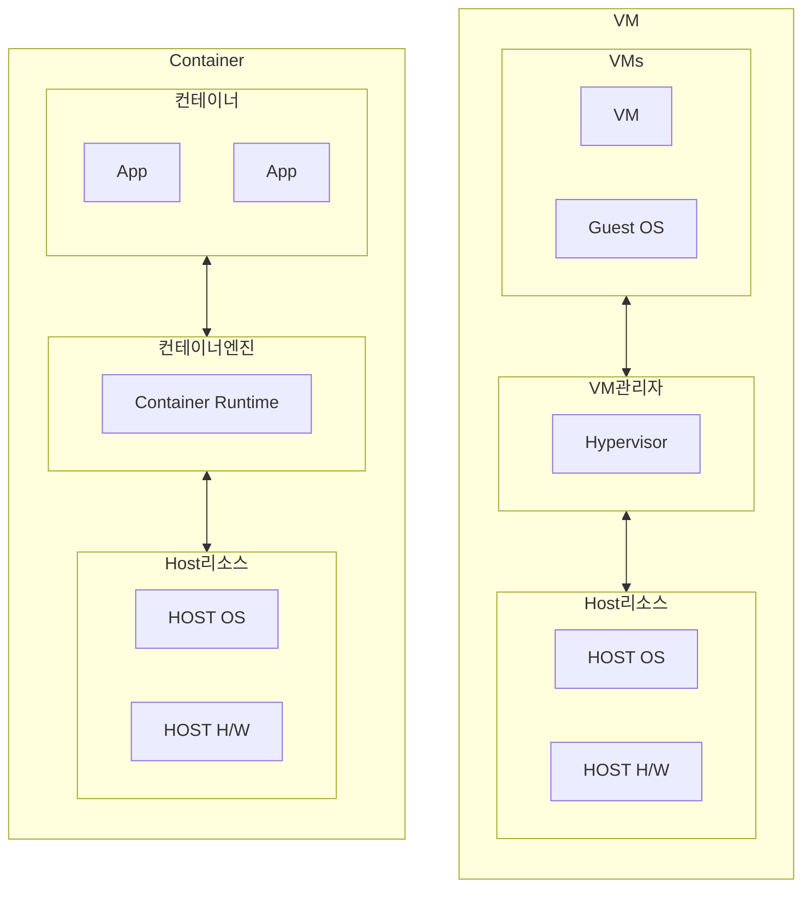

## 가상화의 개념

- 물리적인 자원들을 논리적으로 표현해 효율적으로 사용하고 관리하기 위한 기술
- 클라우드 전환으로 자원활용률, 보안성, 확장성 높은 가상화 기술로 서버 제공, ==논리적 투명성==으로 사용자는 물리적 자원의 세부사항 미고려

## VM, Container의 개념도, 핵심요소, 적용방안

### VM, Container 개념도

- VM: ==하이퍼바이저==를 통해 물리자원을 추상화한 ==Guest OS기반== 가상화
- Container: ==Host OS 커널== 통해 격리된 컨테이너를 제공하는 가상화

### VM, Container 핵심요소 비교

| 구분 | VM | Container |
| --- | --- | --- |
| 핵심기술 | 하이퍼바이저, VM스냅샷 | 컨테이너, 네임스페이스, CGROUP |
| 환경 | 다양한 OS지원, 독점적 자원할당 | 단일 OS지원, 호스트OS커널 공유 |
| 장점 | 강한 보안성, 장애 격리, 다양한 OS 실행 | 빠른 부트시간, 이미지 경량화, 자원사용 효율성 |
| 단점 | 높은 자원 소모, OS 라이센스 비용 | 커널 공유로 인한 낮은 보안성, 호스트OS 종속성 |

### VM, Container 적용방안

| 구분 | VM | Container |
| --- | --- | --- |
| 보안 및 격리 | 높은 보안성과 격리성이 필요한 경우 | 프로세스 수준 격리와 빠른 복구가 필요한 경우 |
| CI/CD | DevOps환경에서 다양한 운영체제 테스트 시나리오 자동화 | IaC 기반, GitOps의 지속적 통합, 배포 |
| 적합 환경 | 기존, 레거시, 모놀리스 | 클라우드 네이티브 |

## 가상화시 고려사항

- 이미지, 스냅샷 레지스트리 관리와 보안 스캐닝을 통해 취약점 사전 조치 필요

### 컨테이너 취약점

| 취약점 | 내용 | 대응방안 |
|---|---|---|
| 스푸핑, Spoofing | 관리자의 인증 정보가 탈취되거나 무단 접근을 시도하는 위협 | 보안 인증 방식(RBAC) 적용, 사용자 계정 관리  |
| 변조, Tampering | 악성 코드를 삽입하거나 데이터 변조를 통해 시스템에 악영향을 미치는 위협 | 이미지 서명 및 무결성 검증, PodSecurityPolicy로 접근 제한 |
| 부인 방지, Repudiation | 감사 및 로그 관리 미흡으로 인해 악의적인 행동을 추적할 수 없는 위협 | 로그 설정 및 관리 강화, 서비스 메시 플랫폼 설정 |
| 정보 유출, Information Disclosure | 중요 데이터(계정 정보 등)가 스니핑이나 오류 메시지 등을 통해 노출되는 위협 | TLS/HTTPS 암호화 통신 적용, 등급별 접근 제한 (RBAC) 적용 |
| 서비스 거부, Denial of Service | 과부하를 유발하여 서비스 가용성을 저하시키는 위협 | 네트워크 정책 강화, 파드 및 노드에 대한 리소스 제한 설정 |
| 권한 상승, Elevation of Privilege | 일반 사용자가 권한을 초과하여 접근함으로써 시스템을 악용할 가능성 | 최소 권한 원칙 적용, 적절한 계정 및 접근 제어 방안 (RBAC) 실시 |
