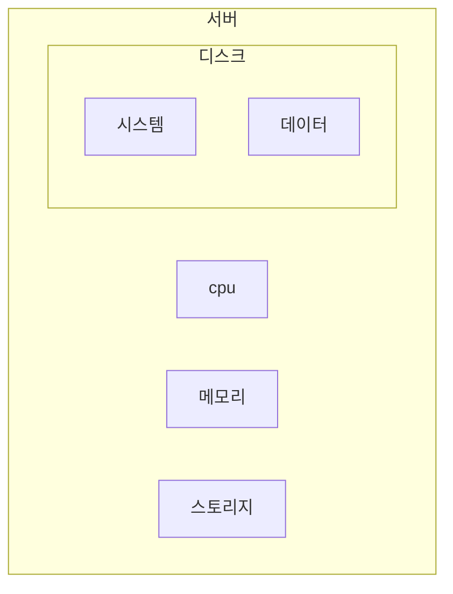

## 정보시스템 하드웨어 규모산정 지침 개념

- 정보시스템 구축 시 필요한 ==하드웨어 자원==의 ==적정 규모를 산정==하기 위한 지침으로 시스템 성능 요구사항을 충족하면서 비용 효율적 H/W 자원을 도입하기 위해 사용
- 경험기반 부정확한 규모산정 사례 증가, H/W 성능 향상으로 인한 기존 표준 개선 요구, 정보화 투자 및 효율 제고

## 정보시스템 하드웨어 규모산정 개념도, 구성요소, 주요기법

### 정보시스템 하드웨어 규모산정 개념도

- 규모산정은 성능요구사항이나 성능을 결정하는 용량계획, 용량관리의 하위 개념

### 정보시스템 하드웨어 규모산정 구성요소

| 구분 | 내용 | 비고 |
| --- | --- | --- |
| 용량관리 | 요구사항 충족을 위해 용량계획수립, 비용-용량 균형 제고 | 조직, 지속적 |
| 용량계획 | 시스템 성능 요구사항과 성능을 결정하기 위한 계획 | 조직, 시스템, 지속적 |
| 규모산정 | 기본적인 용량과 성능 요구사항이 제시되었을 때, 시스템 요구사항으로 반영하는 것 | 시스템, 일시적 |

### 정보시스템 하드웨어 규모산정 주요기법

| 구분 | 내용 | 비고 |
| --- | --- | --- |
| ==수식계산법== | 유저 수 등 규모산정 요소 기반으로 용량 수치를 계산하고 보정하는 방법 | 근거 명확, 보정치 오류 가능성 |
| ==참조법== | 업무량 등 기존 데이터를 기반으로 대략적인 시스템의 규모를 비교하여 산정 | 비교적 안정, 근거 불명확 |
| ==시뮬레이션법== | 대상 업무에 대한 작업 부하를 모델링, 시뮬레이션하여 규모 산정 | 높은 정확성, 시간 및 비용 소요 |

- 공공부문에선 현실적으로 수식계산법을 사용하나, 다른 방법도 필요시 고려

## 정보시스템 하드웨어 규모산정 대상 및 절차

### 정보시스템 하드웨어 규모산정 대상

- CPU, 스토리지는 OLTP, WEB/WAS 등 서버가 받는 부하에 따라 다르게 산정

### 정보시스템 하드웨어 규모산정 절차

1. 구축 방향 및 기초 자료 조사
2. 기초 자료 및 업무 분석
3. 참조 모델 결정 및 서버 규모 산정
4. 참조 모델별 가중치 적용

## 정보시스템 하드웨어 규모산정시 고려사항

- 구축 시스템의 중장기적 측면 고려
- 시스템 전략에 맞는 규모 여부 파악
- 장비 설치 조건의 적합성
- 기종별 슬롯 수 확인
