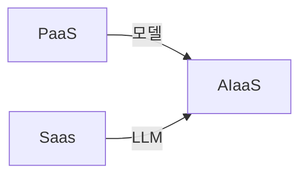
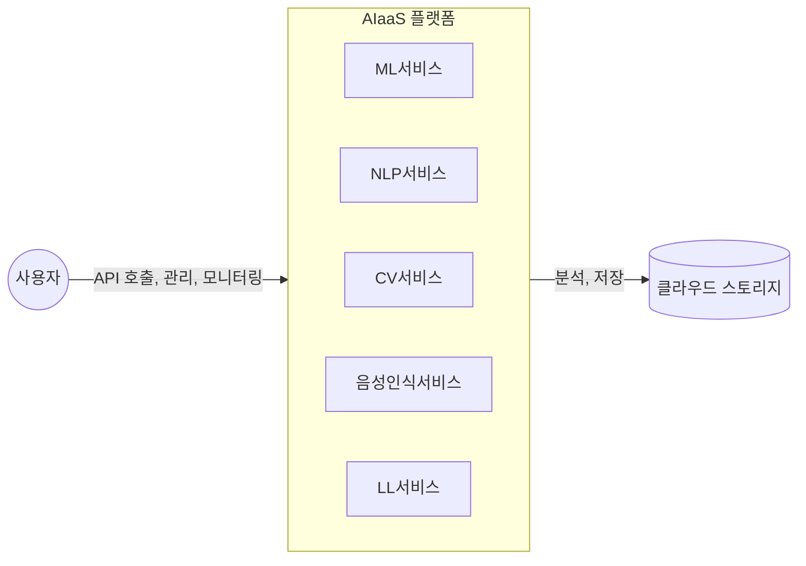

## AIaaS 개념

- AI 학습, 모델링, 자연어처리, CV, 음성인식 등의 AI 기술을 온디맨드로 제공하는 클라우드 서비스 모델

## AIaaS 서비스 구성도, 서비스 유형, 적용사례

### AIaaS 서비스 구성도

### AIaaS 서비스 유형

| 유형 | 내용 | 비고 |
| --- | --- | --- |
| AIaaS 플랫폼 | AI모델 개발, 학습, 배포, 관리 | CSP 사용 |
| ML 서비스 | 머신러닝 모델 학습, 예측, 분류, 평가 | 인공신경망 |
| NLP 서비스 | 텍스트 분석, 번역, 감정분석 | 챗봇 |
| CV 서비스 | 이미지 분석, 비디오 분석, 인식 | YoLo |
| 음성인식 서비스 | STT, 음성 분석 | DeepSpeech |
| LLM 서비스 | 생성형 AI 서비스 제공 | Llama |

### AIaaS 적용사례

- ChatGPT
- Copilot
- Gemini

## AIaaS 고려사항

- 비용, 성능
- 데이터 프라이버시, 폐기 정책
