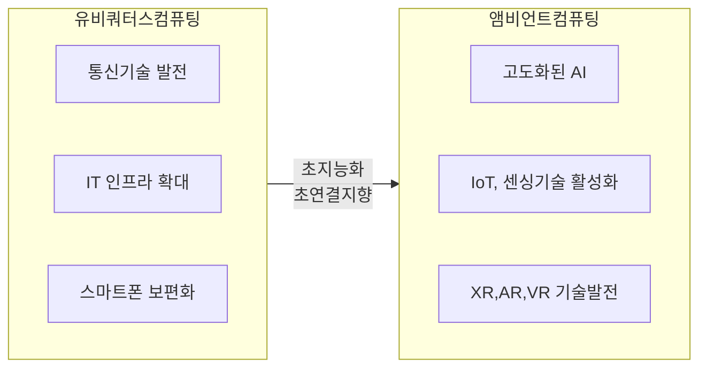
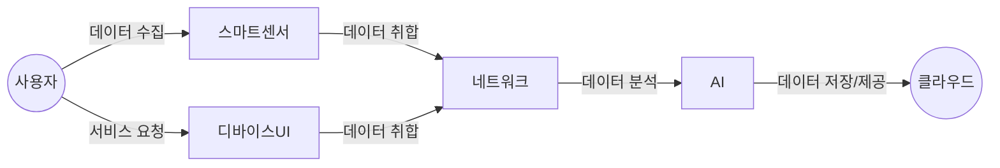
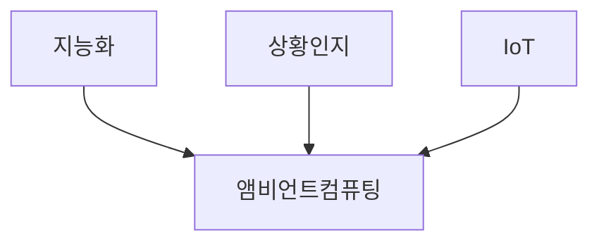

## 앰비언트 컴퓨팅의 개요

### 앰비언트 컴퓨팅의 개념

- 사용자가 컴퓨터의 존재를 인식하지 못하는 상태에서 자연스럽게 컴퓨팅 서비스를 제공하는 기술
- 컴퓨터가 마치 주변 환경의 일부처럼 녹아들어 사용자에게 필요한 정보나 서비스를 자동으로 제공

### 앰비언트 컴퓨팅 등장 배경

- 기술발전: IoT, 센싱, 인공지능, 클라우드 컴퓨팅의 발전으로 인한 기술적 기반
- 사용자 경험 변화: 더 직관적이고 더 편리한 컴퓨팅 환경 요구
- 디지털트랜스포메이션: 사회 전반의 디지털 전환 가속

## 앰비언트 컴퓨팅 개념도, 기술요소

### 앰비언트 컴퓨팅 개념도

### 앰비언트 컴퓨팅 기술요소

| 구분 | 내용 | 비고 |
| --- | --- | --- |
| 센서  | 다양한 환경 정보를 수집하여 사용자 상황 인지 | 온도, 습도, 조도, 위치, 음성 |
| 네트워크  | 센서 데이터를 수집하고 기기 간 통신  | Wi-Fi, Bluetooth, 5G |
| AI | 데이터 분석 및 사용자의 의도 파악하여 맞춤형 서비스 제공 | 머신러닝, 자연어 처리 |
| 클라우드 | 데이터 저장, 분석, 처리를 위한 클라우드 컴퓨팅 환경 | 확장성, 안정성 제공 |
| 사용자 인터페이스 | 음성, 제스처 등 자연스러운 상호작용 방식 | 사용자 편의성 증대 |

## 앰비언트 컴퓨팅과 IoT 비교

### 앰비언트 컴퓨팅과 IoT의 관계도

### 앰비언트 컴퓨팅과 IoT 상세 비교

| 구분 | 앰비언트 컴퓨팅 | IoT |
| --- | --- | --- |
| 개념 | 사용자가 인식하지 않아도 자연스럽게 작동하는 컴퓨팅 | 다양한 기기가 네트워크에 연결되어 데이터 수집 및 제어 기능 수행 |
| 목표 | 사용자 경험의 극대화 및 맞춤형 서비스 제공  | 기기 간의 연결성 및 데이터 교환 |
| 기술 요소 | 센서, AI, 클라우드 컴퓨팅 등 | 센서, 네트워크, 데이터 분석 등 |
| 적용 분야 | 스마트 홈, 스마트 시티, 헬스케어 등 | 산업 자동화, 스마트 시티, 스마트 농업 등 |
| 서비스 제공 방식 | 사용자 행동 및 환경 분석을 통한 자동화 방식 | 사용자가 직접 제어하거나 사전 설정된 방식 |

## 앰비언트 컴퓨팅 활용 방안

| 구분 | 내용 | 비고 |
| --- | --- | --- |
| 공공 | 도시 관리 효율성 향상, 시민 편의 증진 | 스마트 시티, 스마트 교통, 스마트 환경 등 |
| 금융 | 금융 서비스 접근성 향상, 보안 강화 | 개인 맞춤형 금융 서비스, 지능형 보안 시스템 등 |
| 민간 | 생활 편의성 증대, 생산성 향상, 건강 관리 | 스마트 홈, 스마트 팩토리, 스마트 헬스케어 등 |
