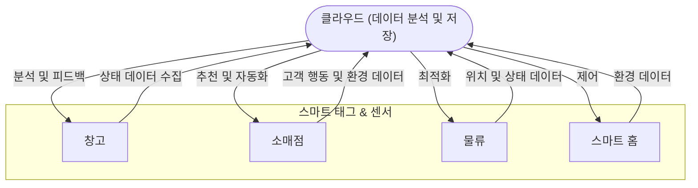

## 앰비언트 인비저블 인텔리전스

- 소형의 스마트 태그와 센서를 활용하여 다양한 물체와 환경의 위치 및 상태를 추적하는 기술로, 수집된 데이터는 클라우드로 전송되어 분석 및 의사결정에 활용
- 공급망 효율화, 냉장 상품 품질 유지, 의료 데이터 관리 등 다양한 분야에서 효율성과 비용 절감 / 장기적으로 초저가 전자 제품과 통합 게이트웨이를 통해 더욱 광범위한 환경에 적용

## 앰비언트 인비저블 인텔리전스 개념도, 핵심요소, 활용방안

### 앰비언트 인비저블 인텔리전스 개념도

### 앰비언트 인비저블 인텔리전스 핵심요소

| 구분 | 핵심요소 | 설명 |
| --- | --- | --- |
| 데이터 수집 | 센서 및 태그 | IoT 센서, Bluetooth, 5G, 백스캐터 등을 활용한 데이터 수집 |
| 에너지 관리 | 에너지 수확 기술 | 배터리 없는 장치를 통한 지속적 전력 공급 |
| 데이터 처리 | 클라우드 분석 | 데이터를 클라우드에 저장 및 분석하여 인사이트 도출 |
| 네트워크 | 게이트웨이와 수신기 | 데이터 전달 및 기기 간 연결 지원 |
| 피드백 제공 | 통합 소프트웨어 | 수집된 정보를 활용하여 자동화된 의사결정과 환경 제어 지원 |

### 앰비언트 인비저블 인텔리전스 활용방안

| 분야 | 사례 | 기대 효과 |
| --- | --- | --- |
| 소매업 | 실시간 재고 확인 및 부패 방지 냉장 관리 | 공급망 최적화, 비용 절감 |
| 의료 | 환자 복약 준수 모니터링 | 건강 관리 향상, 오류 방지 |
| 가전 제품 | 의류 센서가 세탁기와 통신하여 최적 세탁 모드 설정 | 사용자 편의성 및 에너지 효율 증대 |
| 물류 | 스마트 포장을 통한 품목 위치 추적 | 배송 효율성 향상 및 분실 방지 |
| 제조 | 장비와 부품이 재고 수준에 따라 자동 주문 수행 | 생산성 증대 및 다운타임 최소화 |

## 앰비언트 인비저블 인텔리전스 도입을 위한 고려사항

| 구분 | 고려사항 | 내용 |
| --- | --- | --- |
| 데이터 프라이버시 | 사용자 추적 방지 | 의류 센서와 같은 기술의 개인정보 보호 대책 필요 |
| 표준화 | 통합 프로토콜 개발 | 다양한 기기와의 호환성 및 상호작용 보장 |
| 비용 | 저비용 구현 가능성 | 초저가 센서와 태그를 통한 비용 효율적 확산 |
