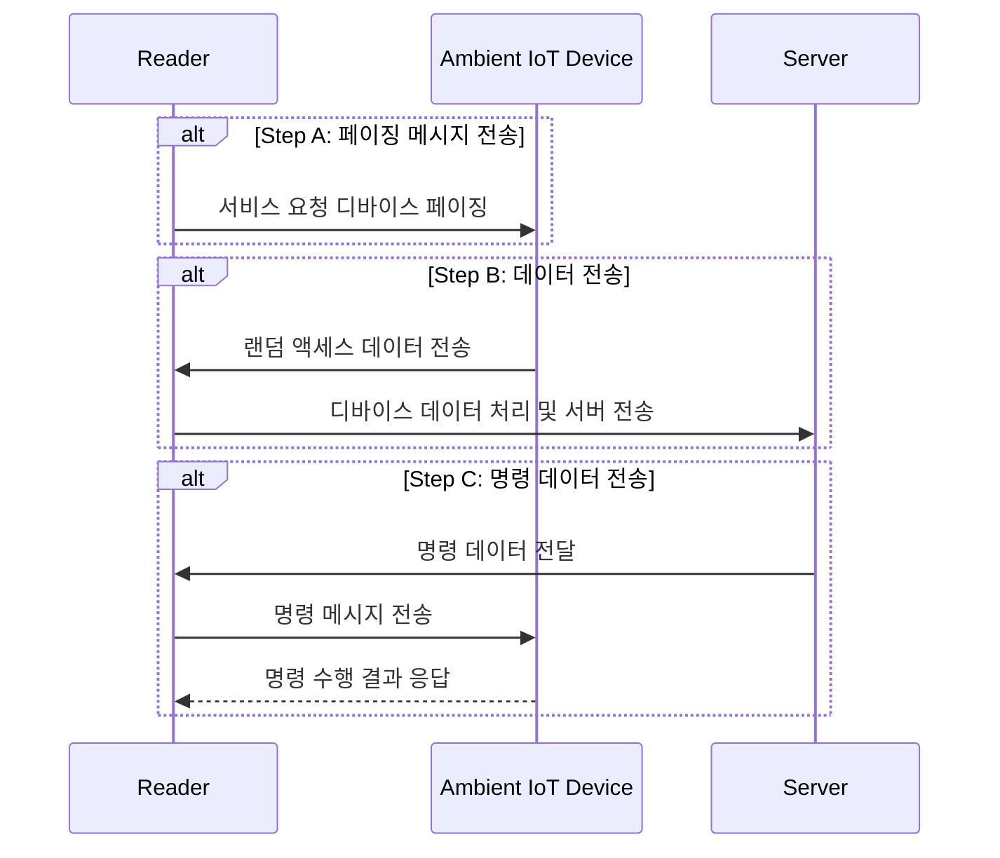

## 앰비언트 IoT 개요

### 앰비언트 IoT 개념

- 에너지 하베스팅 기술을 기반으로, 배터리 없는 IoT 디바이스 또는 저전력 디바이스를 구현하여 환경적 지속 가능성과 유지보수 비용 절감을 목표로 하는 기술
- 전파, 빛 동작, 열 등을 에너지원으로 사용, 기존 NB-IoT 및 LTE-M 대비 낮은 전력 소비와 간단한 설계, 6G 초연결성 지원, 다양한 IoT 어플리케이션 적용

### 앰비언트 IoT 등장배경

| 구분 | 배경 | 내용 |
| --- | --- | --- |
| 기술적 요구 | IoT 디바이스 급증 | 수십억 개 IoT 디바이스로 인한 배터리 교체 및 유지보수 부담 |
| 환경적 요인 | 에너지 소비와 환경 문제 | 배터리 사용을 줄이고 에너지 하베스팅 기술로 지속 가능성 강화 |
| 미래 요구 | 6G 및 mMTC 기술 확장 필요 |초연결성 요구 해결 및 높은 연결 밀도 지원 |

## 앰비언트 IoT 프로시저, 기능요구사항, 유즈케이스

### 앰비언트 IoT 프로시저

- 프로시저를 효과적으로 구현하기 위해 앰비언트 IoT 시스템의 기능요구사항 충족 필요

### 앰비언트 IoT 기능요구사항

| 구분 | 요구사항 | 내용 |
| --- | --- | --- |
| 통신 | 그룹 통신 | 다수의 IoT 디바이스와 동시 통신 가능 |
| | 인증 및 보안 | 인증 절차와 데이터 보안 강화 |
| 위치 및 관리 | 위치 서비스 제공 | 실시간 위치 추적 및 보고 |
| | 디바이스 활성화/비활성화 관리 | RF 신호 전송을 통한 디바이스 제어 기능 |
| 데이터 관리 | 외부 시스템 연동 | 사용자 동의 하에 제3자에게 데이터 제공 가능 |
| | 강력한 시큐리티 보호 | 전송 데이터 암호화 및 무결성 보장 |

### 앰비언트 IoT 유즈케이스

| 구분 | 사례 | 비고 |
| --- | --- | --- |
| 재고 관리 | 재고 물품 상태 및 위치를 자동화로 확인 | 자동화 창고, 의료 기기 관리 |
| 센서 | 환경 데이터 수집 및 실시간 전송 | 산불 모니터링, 스마트 농업 등 |
| 포지셔닝 | 디바이스 위치를 실시간으로 추적 | 분실물 탐지, 쇼핑몰 내 위치 파악 |
| 명령  | 디바이스를 제어하거나 상태 변경 명령 전송 | 전자 라벨, 디바이스 활성화/비활성화 명령 |

## 앰비언트 IoT 발전방향

| 구분 | 발전 방향 | 내용 |
| --- | --- | --- |
| 에너지 효율 | 배터리리스 기술 확대 | 빛, 열, RF 신호 등 환경 에너지 활용한 배터리 없는 IoT 디바이스 실현 |
| | 동적 에너지 관리 시스템 | AI 기반 에너지 수집 및 분배 최적화로 에너지 사용 최소화 |
| 확장성 및 표준화 | 6G와의 통합 | 초저지연 네트워크와 대규모 IoT 연결 지원하여 더 높은 데이터 전송 속도와 넓은 커버리지 제공 |
| | 국제 표준화 | 3GPP, IEEE와 협력하여 글로벌 표준 정립, 상호운용성 강화 및 산업 협력 촉진 |

## 참조

- [IITP: 주간기술동향 2150호](https://iitp.kr/kr/1/knowledge/periodicalViewA.it?searClassCode=B_ITA_01&masterCode=publication&identifier=1335)
