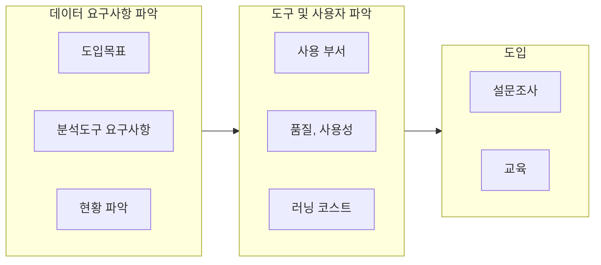

## 빅데이터 분석도구 개념

- 대량의 데이터를 분석을 통해 가치 있고 활용 가능한 정보를 얻을 수 있게 하는 도구

## 빅데이터 분석도구 선택 원칙, 선정 방안

### 조직 관점 선택 원칙

| 구분 | 원칙 | 내용 |
| --- | --- | --- |
| 품질 | 기능성 | 빅데이터 처리 시각화 기능 등 |
| - | 실행효율성 | 데이터 처리 속도, 하드웨어 사용량 |
| - | 호환성, 이식성 | 정형, 비정형 데이터 처리, OS 종속성 |
| - | 보안성 | 데이터 침해, 개인정보 침해 |
| 사용성 | 학습성, 이해용이성 | 러닝 코스트 측정 |
| - | 접근성, 편의성 | UI 모델링 용이성 |
| - | 운영성 | 벤더 지원 여부, EoS 등 |

- ISO 25000 관점에서 분석도구의 품질과 사용성 평가

### 핵심기능 관점 선택 원칙

| 원칙 | 내용 | 비고 |
| --- | --- | --- |
| 분석 능력 | 다양한 유형의 분석 기법 | SVM, 의사결정트리, 시계열 등 |
| 데이터 통합관리 | 별도 통계도구, 언어 지원 | 주피터 노트북, 사용자 대시보드 등 |
| 데이터 가져오기, 내보내기 | 다양한 포맷의 데이터 입출력 | CSV, XLSX 등 지원 |

- 조직 내 데이터 요구사항, 구성원의 기술스택 고려 선정

### 빅데이터 분석도구 선정 방안

## 빅데이터 분석도구 선택 고려사항

- 실시간 데이터를 받기 위해 UDP, JSONL 지원 여부 고려
- 데이터 조회, 그룹핑 분석을 위한 Query Language 지원 여부 고려
