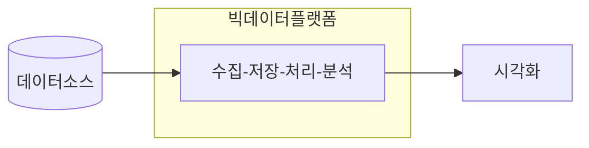

## 빅테이터 플랫폼 아키텍처 개념

- 빅데이터의 3V(크기, 다양성, 속도) 측면을 효과적으로 처리, 분석하기 위한 시스템 아키텍처

## 빅데이터 플랫폼 아키텍처 구성도, 구성요소, 적용방안

### 빅데이터 플랫폼 아키텍처 구성도

### 빅데이터 플랫폼 아키텍처 구성요소

| 구분 | 내용 | 비고 |
| --- | --- | --- |
| 데이터수집 | 실시간 데이터 수집 | Kafka |
| 데이터저장 | 대용량 데이터 저장 | HDFS, S3, NoSQL DB |
| 데이터처리 | 배치 및 실시간 처리 | Spark, MapReduce |
| 데이터분석 | SQL 기반 데이터 분석 | Hive, Spark SQL |
| 데이터시각화 | 분석 결과 시각화 | Tableau, Grafana |

### 빅데이터 플랫폼 아키텍처 적용방안

| 구분 | 내용 | 비고 |
| --- | --- | --- |
| 소셜미디어 분석 | 사용자 행동 패턴 분석 | 실시간 처리 |
| 로그 분석 | 시스템 장애 예측, 최적화 | 대용량 처리 |
| 금융사기탐지 | 이상거래 탐지, 사기 탐지 | 실시간 처리, AI |

## 빅데이터 플랫폼 아키텍처 고려사항

| 구분 | 내용 | 비고 |
| --- | --- | --- |
| 확장성 | 데이터 증가에 따른 유연한 대응 | 수평적 확장 고려 |
| 성능 | 빠른 데이터 처리 분석 속도 | 실시간 처리 요구사항 |
| 보안 | 데이터 접근통제 암호화 | 분석 후 폐기, RBAC |
| 비용 | 효율적 자원 활용, 스케일 다운 | 클라우드 기반 아키텍처 |
