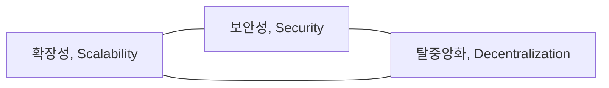

## 블록체인 트릴레마 개념

- 블록체인의 세 가지 특성인 확장성, 보안성, 탈중앙화 모두를 충족하기는 불가능, 일부를 만족시키기 위해서는 다른 특성을 포기해야하는 문제

## 블록체인 트릴레마 특성, 유형별 트릴레마, 해결방안

### 블록체인 트릴레마 특성

### 블록체인 유형별 트릴레마

| 유형 | 트릴레마 | 설명 |
| --- | --- | --- |
| 퍼블릭 블록체인 | 탈중앙화 및 보안 강화, 확장성 저하 | 모든 참여자가 네트워크 참여하고 블록 검증 |
| 프라이빗 블록체인 | 보안 및 확장성 강화, 탈중앙화 저하 | 중앙 기관이 네트워크 통제, 탈중앙화 이점 포기 |
| 컨소시엄 블록체인 | 보안 및 확장성 강화, 탈중앙화 선택 | 특정 그룹이 네트워크를 관리, 불완전한 탈중앙화 |
| 하이브리드 블록체인 | 탈중앙화, 보안, 확장성의 균형 | 퍼블릭과 프라이빗 블록체인 장점 결합하여 트릴레마 해소 |

### 쁠록체인 트릴레마 해결방안

| 구분 | 해결방안 | 비고 |
| --- | --- | --- |
| 확장성 | 샤딩, 레이어링, 포크 | 블록체인 병렬 및 분산 처리 |
| 보안성 | 다중서명, 영지식 증명 활용 | 합의 알고리즘 개선 |
| 탈중앙화 | 오프체인, 온체인 | 권력 분산 |

## 블록체인 트릴레마 주요 사례

| 구분 | 트릴레마 | 설명 |
| --- | --- | --- |
| 비트코인 | 낮은 확장성, 높은 탈중앙화 | 네트워크 확장에 따른 트랜잭션 속도 저하 |
| 이더리움 | 낮은 확장성, 높은 보안성 | 스마트컨트랙트, DApp 지원으로 인한 확장성 문제 |
| 리플 | 낮은 탈중앙화, 높은 확장성 | 위임 노드들의 합의 방식으로 낮은 탈중앙화 |
