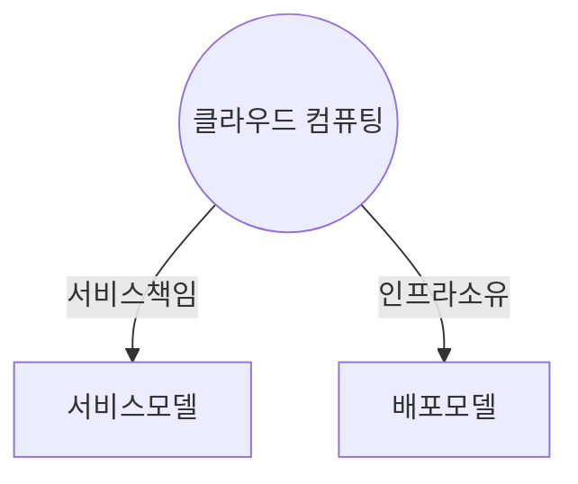
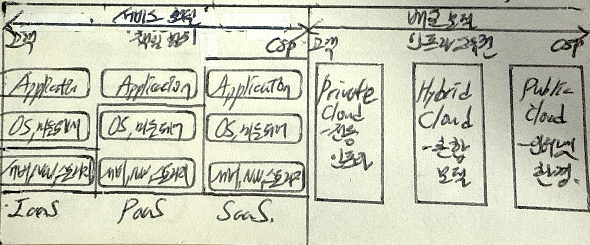

## 클라우드 컴퓨팅의 개념

- 가상화 기술을 이용하여 사용자 필요시 인터넷을 통해서 서비스 형태로 IT자원을 제공하는 컴퓨팅 기법
- 클라우드 컴퓨팅에 대한 고객, CSP의 서비스책임 범위, 인프라 소유권에 따라 서비스모델, 배포모델로 분류

## 클라우드 컴퓨팅 모델의 구성도, 구성요소, 비교

### 클라우드 컴퓨팅 모델의 구성도

### 클라우드 컴퓨팅 모델의 구성요소

- 서비스 모델: 클라우드 자원의 제공 방식에 따른 분류

| 구분 | 내용 | 비고 |
| --- | --- | --- |
| IaaS | 인프라(서버, 스토리지, 네트워크 등)를 제공하는 모델 | 사용자 관리 책임 |
| PaaS | 플랫폼(개발 도구, 데이터베이스, 런타임 환경 등)을 제공하는 모델 | 공통 관리 책임 |
| SaaS | 소프트웨어(애플리케이션)를 제공하는 모델 | 제공자 관리 책임 |

- 배포 모델: 클라우드 자원 소유주체와 관리방식에 따른 분류

| 구분 | 내용 | 비고 |
| --- | --- | --- |
| Private | 특정 조직만을 위해 독립적으로 구축된 클라우드 환경 | 사용자 소유 |
| Public | 일반 대중에게 공개되어 누구나 이용 가능한 클라우드 환경 | 제공자 소유 |
| Hybrid | Private Cloud와 Public Cloud를 혼합하여 사용하는 모델 | 혼합 모델 |

### 배포모델과 서비스모델 비교

| 구분 | 배포모델 | 서비스모델 |
| --- | --- | --- |
| 목적 | 지속 가능 서비스 기반 | 온디맨드 서비스 |
| 범위 | 클라우드 구성 환경 | 클라우드 서비스 |
| 접근 | 온프레미스와의 연결성 | 비용 절감 |

- 온프레미스 서비스의 구성 환경에 따라 배포모델을 선택하고, 비지니스 요구사항과 비용에 맞는 서비스모델을 선택

## 클라우드 컴퓨팅 활성전략

| 구분 | 활성전략 | 내용 |
| --- | --- | --- |
| 배포모델 | 공공기관/지자체 민관협력형 클라우드 | 공공기관이 민간 CSP와 협력해 전용 클라우드 환경 구축 |
| | 금융사 하이브리드 멀티 클라우드 | 금융권이 퍼블릭·프라이빗 클라우드를 혼합 운영해 보안·효율성 확보 |
| 서비스모델 | CNCF Cloud Native App | 컨테이너·마이크로서비스 기반 클라우드 네이티브 앱 개발 모델 |
| | K-PaaS | 국내 맞춤형 PaaS, 개발·운영 환경 지원 |

- 기업은 목적에 맞는 전략을 활용하여 적절한 모델을 선택

## 클라우드 컴퓨팅 고려사항

- 해당 국가의 법, 제도적 규제사항을 만족하기위한 소버린클라우드와 재난시 빠른 복구가 가능한 멀티클라우드 구축 고려
