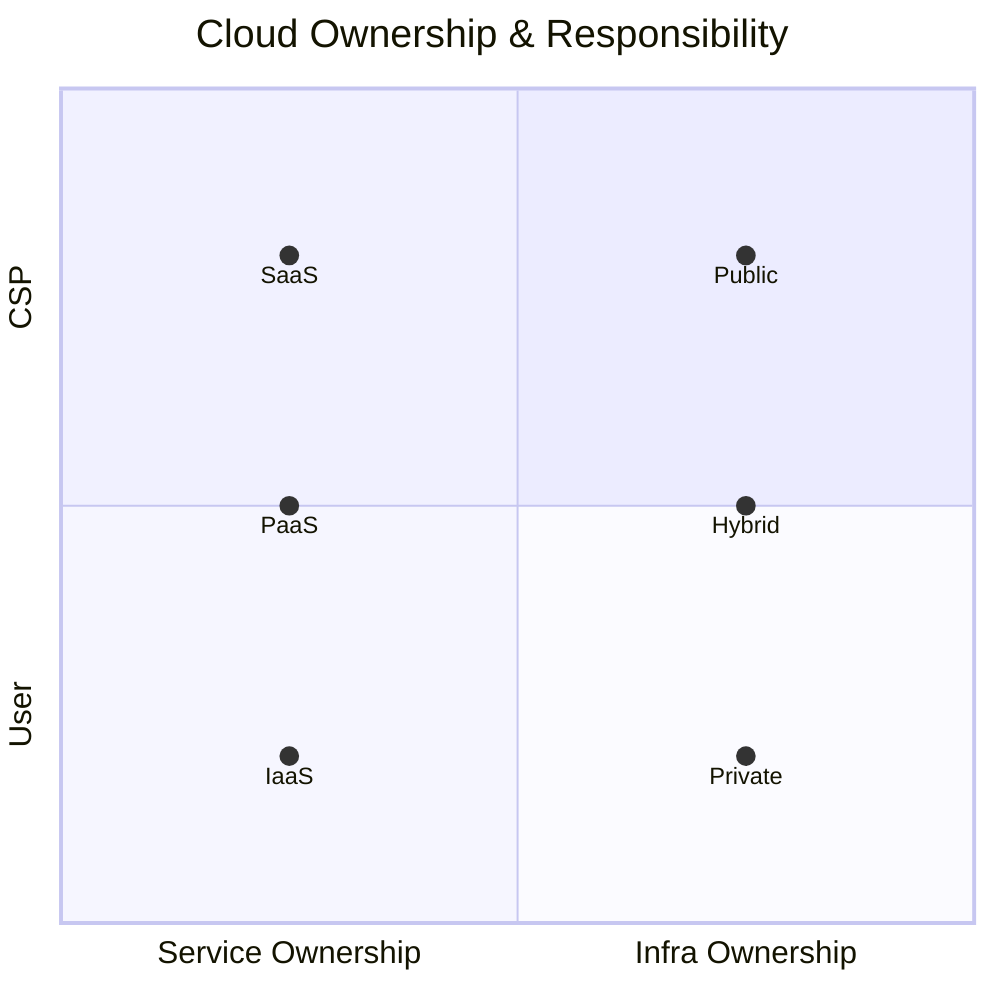

## 클라우드 컴퓨팅의 개념

- 가상화 기술을 이용하여 사용자 필요시 인터넷을 통해서 서비스 형태로 IT자원을 제공하는 컴퓨팅 기법
- 서비스 책임범위, 인프라 소유권에 따라 다양한 모델 등장

## 클라우드 컴퓨팅 모델의 구성도, 구성요소, 비교

### 클라우드 컴퓨팅 모델의 구성도

### 클라우드 컴퓨팅 모델의 구성요소

- 서비스 모델: 클라우드 자원의 제공 방식에 따른 분류

| 구분 | 내용 | 비고 |
| --- | --- | --- |
| IaaS | -    | 사용자 관리 책임 |
| PaaS | -    | 공통 관리 책임   |
| SaaS | -    | 제공자 관리 책임 |

- 배포 모델: 클라우드 자원 소유주체와 관리방식에 따른 분류

| 구분 | 내용 | 비고 |
| --- | --- | --- |
| Private | -    | 사용자 소유 |
| Public  | -    | 제공자 소유 |
| Hybrid  | -    | 혼합 모델   |

### 배포모델과 서비스모델 비교

| 구분 | 배포모델 | 서비스모델 |
| --- | --- | --- |
| 목적 | 지속 가능 서비스 기반 | 온디맨드 서비스 |
| 범위 | 클라우드 구성 환경    | 클라우드 서비스 |
| 접근 | 온프레미스와의 연결성 | 비용 절감       |

- 온프레미스 서비스의 구성 환경에 따라 배포모델을 선택하고, 비지니스 요구사항과 비용에 맞는 서비스모델을 선택.

## 클라우드 컴퓨팅 활성전략

| 구분 | 내용 | 비고 |
| --- | --- | --- |
| 배포모델 | 공공기관/지자체 민관협력형 클라우드 | -  |
| - | 금융사 하이브리드 멀티 클라우드 | - |
| 서비스모델 | CNCF Cloud Native App | -    |
| - | K-PaaS | - |

- 기업은 목적에 맞는 전략을 활용하여 적절한 모델을 선택.

## 클라우드 컴퓨팅 고려사항

- 해당 국가의 법, 제도적 규제사항을 만족하기위한 소버린클라우드와 재난시 빠른 복구가 가능한 멀티클라우드 구축 고려
