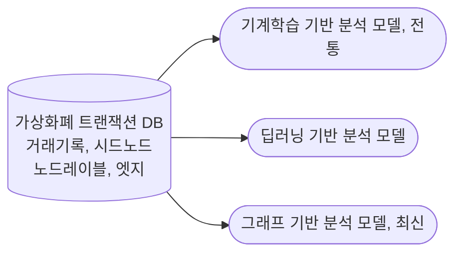
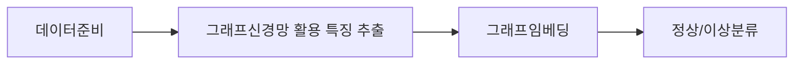

## 가상화폐 스캠 개념

- 폰지사기라고 표현되며 가격의 높은 변동성과 익명성을 악용해 투자자들을 속이는 위협
- 블록체인, 가상화폐의 급속한 발전으로 폰지사기, 피싱공격, 가짜 ICOs, 러그폰, 다중서명지갑 해킹 등 다양한 유형의 사기 범죄 출현

## 가상화폐 스캠 탐지 개념도, 분석 유형, 탐지 절차

### 가상화폐 스캠탐지 개념도

### 가상화폐 스캠탐지 분석 유형

| 기반 | 유형 | 내용 |
| --- | --- | --- |
| 기계학습 기반 | 로지스틱 회귀 | 거래 데이터의 다양한 속성 기반으로 확률 분석하여 결정 경계 정의 |
| - | 랜덤포레스트 | 다수의 결정 트리로 거래 특성 분석, 종합하여 스캠 여부 판별 |
| - | SVM | 거래 데이터를 고차원에서 분류하여 최적 결정경계를 찾아서 높은 정확도 |
| - | ADABoost | 약분류기 결합, 반복학습, 스캠 특성 포착 |
| - | LGBM | 복잡한 거래 뎅치터를 수직적 방식으로 빠르게 탐지 |
| 딥러닝 기반 | LSTM-FCN&BP | LSTM-FCN과 BP 신경망을 결합한 하이브리드 모델 사용 |
| - | LSTM-CNN | 순차 데이터 처리용 LSTM과 구조적 특징 파악용 CNN 결합 |
| 그래프 기반 경로임베딩 | Trans2Vec | 거래량과 타임스탬프에 랜덤워크 기법과 SVM 활용 분류 |
| - | Node2Vec | EtherScanDB로 Node2Vec과 SVM 활용 분류 |
| 그래프신경망 기반 그래프 임베딩 | GCN | 노드와 이웃 간 정보 집계 후 노드 임베딩 생성 |
| - | TTAGN | 거래내역 시간, 구조적 정보를 통합, LSTM, 어텐션 활용 스캠 탐지 |

### 가상화폐 스캠탐지 절차

## 가상화폐 스캠탐지시 고려사항

- 클래스 불균형으로 인한 오탐 방지 위해 오버샘플링, 언더샘플링, 가중치 조정 등 고려
- 가상화폐 거래 네트워크의 지속적 변화 학습
