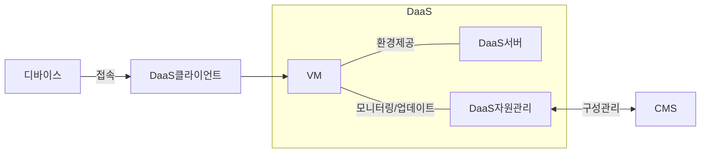

## DaaS 개념

- 클라우드 기반 가상화 기술을 활용하여 사용자에게 ==데스크탑 환경을 제공==하는 ==클라우드 서비스 모델==

## DaaS 구성도, 구성요소, 적용방안

### DaaS 구성도

- 사용자는 자신의 디바이스로 DaaS클라이언트에 접근하여 디바이스, 지역에 관계없이 업무 수행 가능

### DaaS 구성요소

| 구분 | 내용 | 비고 |
| --- | --- | --- |
| DaaS클라이언트 | 원격 VM에 접근하기 위한 클라이언트 | VMWare 등 |
| DaaS서버 | VM 환경 제공, 연결 관리 | 하이퍼바이저, 커넥션매니저 |
| DaaS자원관리 | 자원 모니터링, 프로비저닝, 패치 | CMS 연동 |
| CMS | 조직 구성 관리 자동화 | SW 패치, 라이센스 관리 |

### DaaS 적용방안

| 구분 | 내용 | 비고 |
| --- | --- | --- |
| 원격업무지원 | 재택, 원격 근무자에게 내부망 환경 제공 | HW 구매비용 절감 |
| 계약직 | 계약, 계절적 업무 증가시 IT인프라 제공 | 유연한 확장 |
| 직원 교육 | 교육기관에서 일관된 학습 환경 제공 | OS, Tool 등 |

## DaaS 고려사항

- CSAP DaaS 인증을 대비하여, DaaS 접근시 2차인증과 종료시 데이터 파기 절차 필요
- 금융권 망분리 완화로 인한 인프라 확보 필요
