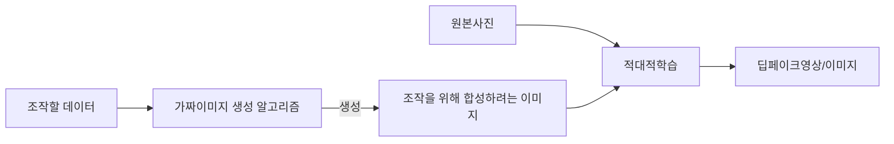

## 딥페이크의 개요

### 딥페이크의 개념

- 인공지능 기술을 활용해 기존 인물의 얼굴이나 특정 부위, 음성을 다른 이미지, 영상에 합성하는 기술

### 딥페이크의 등장배경

- 생성적 적대 신경망 기술의 도입으로 정교하고 사실적인 합성 결과물이 제작되어, 가짜 뉴스, 포르노 등 역기능 발생

## 딥페이크의 개념도, 주요기술, 사례

### 딥페이크의 개념도

### 딥페이크의 주요기술

|구분|주요 기술|설명|
|---|---|---|
| 데이터 |수집 및 훈련 | Source 및 Target 영상을 학습하여 GAN으로 가짜영상을 진짜처럼 학습 |
| | 프레임 적용 및 합성 | 색깔, 동작 정보를 LSTM 네트워크로 처리해 영상 재생성 |
| 알고리즘 | GAN | 동영상의 모션 패턴을 모델링하여 3D 모델로 재구성 |
| | LSTM | 이전 프레임과 현재 프레임의 차이를 벡터화 처리 |

### 딥페이크의 사례

| 구분 | 내용| 비고|
| --- | --- | --- |
| 국내 | 연예인 얼굴 합성 음란물, 정치인 얼굴 합성 가짜 뉴스 | 사회적 논란 및 피해 발생 |
| 국외 | 영화 배우 대역 활용| 긍정적 활용 가능성 제시 |

## 딥페이크 고려사항

| 구분| 내용  | 비고|
| -- | --- | --- |
| 관리적 | 오용을 방지위한 윤리적 가이드라인 필요| 내부 관리 체계 구축 |
| 기술적 | 워터마킹, NSFW 영상 업로드 필터링| 탐지, 검증 고도화|
| 제도적 | 제작 및 유포에 대한 법적 규제 및 처벌 기준 마련 | 국제적 협력 필요|
