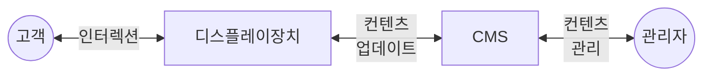

## DID 개념

- 화면을 통해 텍스트, 이미지, 비디오, 인터렉티브 요소와 같은 ==동적 컨텐츠를 표시하는 시각적 커뮤니케이션 도구==
- 물리적 자료 인쇄, 배포에 드는 비용 절감, 효율적인 정보 전달 가능

## DID 구성도, 구성요소, 활용사례

### DID 구성도

- CMS를 통해 다양한 디스플레이 장치에 정보 표현

### DID 구성요소

| 구분 | 내용 | 핵심기술 |
| --- | --- | --- |
| 디스플레이 장치 | 텍스트, 이미지, 비디오 등 다양한 형태의 컨텐츠 표시 | LCD/LED/OLED 디스플레이 |
| 콘텐츠 관리 시스템 | 디스플레이에 표시될 컨텐츠 생성, 편집, 관리 소프트웨어 | 웹 기반, 데이터베이스 |
| 네트워크 | 디스플레이 장치와 CMS 간의 데이터 전송, 원격 업데이트용 네트워크 인프라 | 엣지 컴퓨팅 |
| 인터렉티브 요소 | 사용자와 상호작용할 수 있는 기능 제공하여 경험 향상 | 터치스크린, 센싱 |

### DID 활용사례

| 구분 | 사례 | 비고 |
| --- | --- | --- |
| 공공 | 항공정보, 안내방송, 광고 등 공공 정보 제공 | 실시간 업데이트 |
| 금융 | 수업 시간표, 이벤트 알림, 공지사항 등 정보 제공 | 정보 집중도 증가 |
| 민간 | 회의 일정, 공지사항, 직원 정보 제공 | 내부 커뮤니케이션 |

## DID 고려사항

- 앰비언트 컴퓨팅을 활용하여 사용자에게 맞춤형, 적응형 컨텐츠 표현
