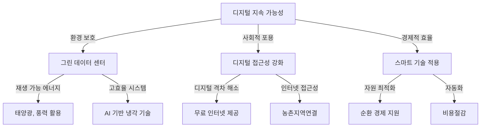

## 디지털 지속가능성 개념

- 디지털 기술과 인프라를 활용하여 환경, 사회, 경제적 지속 가능성을 동시에 추구하는 개념
- 필요성
  - 환경적 필요성: 데이터 센터 및 ICT 인프라의 에너지 소비 증가에 따른 탄소 배출 저감 필요
  - 사회적 필요성: 디지털 격차 해소를 통한 포용적 성장 및 전 세계적 접근성 확보
  - 경제적 필요성: 디지털 기술을 통한 생산성 향상과 자원 최적화로 지속 가능한 성장 촉진

## 디지털 지속가능성 개념도, 핵심요소, 실현방안

### 디지털 지속가능성 개념도

### 디지털 지속가능성 핵심요소

| 핵심 요소 | 설명 | 적용 사례 |
| --- | --- | --- |
| 환경적 지속 가능성 | 디지털 기술로 에너지 소비 절감 및 탄소 배출 최소화 | Microsoft의 100% 재생 가능 에너지 데이터 센터 |
| 사회적 지속 가능성 | 디지털 접근성을 높여 소외 계층의 기술 혜택 보장 | Google의 Project Loon, 농촌 지역 인터넷 연결 |
| 경제적 지속 가능성 | 디지털 기술을 활용한 생산성 향상 및 비용 절감 | 스마트 팩토리 도입을 통한 제조 비용 절감 |

### 디지털 지속가능성 실현방안

| 실현 방안 | 내용 | 기대 효과 |
| --- | --- | --- |
| 그린 데이터 센터 구축 | 에너지 효율적인 서버 및 재생 가능 에너지 도입 | 운영 비용 절감 및 탄소 배출 저감 |
| 디지털 탄소 발자국 감소 | 클라우드 및 엣지 컴퓨팅 활용으로 에너지 소비 최적화 | IT 인프라의 지속 가능성 향상 |
| 순환 경제 지원 | IT 장비 재활용 및 부품 업사이클링 강화 | 전자 폐기물 감축 및 자원 재활용 증가 |
| 디지털 포용성 강화 | 저개발국 및 농촌 지역 인터넷 접근성 확대 | 글로벌 디지털 격차 해소 |
| 정부-기업 협력 강화 | 디지털 지속 가능성을 위한 정책 및 규제 마련 | 장기적인 지속 가능성 확보 |

## 디지털 지속가능성 발전방향

| 구분 | 세부 내용 | 발전 방향 |
| --- | --- | --- |
| 기술적 | 고성능 컴퓨팅의 에너지 소모 문제 | 양자컴퓨팅 및 AI 기반 자원 최적화 기술 도입 |
| 정책적 | 디지털 지속 가능성을 보장하는 국제적 표준과 규제 부재 | ISO 및 ITU를 통한 글로벌 표준화 작업 가속화 |
| 사회적 과제 | 저소득 국가와 지역 간 디지털 격차 | 공공과 민간 협력을 통한 인프라 투자 확대 |
