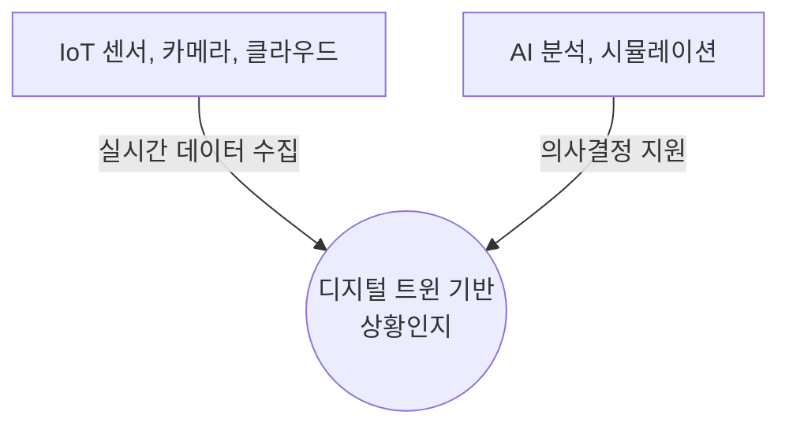
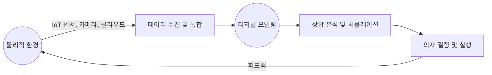

## 디지털 트윈 기반 상황인지 개념

- 현실 세계의 데이터를 실시간으로 수집하고 디지털 공간 복제하여 현재 상태를 이해하고, 미래 상황을 예측하여 최적의 의사 결정을 지원
- 제조, 스마트시티, 의료 등 다양한 분야에서 실시간 의사 결정의 정확성과 신속성 제고 / 시뮬레이션 데이터 기반 가치 판단

## 디지털 트윈 기반 상황인지 기술 구성도, 동작원리, 적용사례

### 디지털 트윈 기반 상황인지 기술 구성도

### 디지털 트윈 기반 상황인지 동작원리

| 단계 | 내용 | 비고 |
| --- | --- | --- |
| 데이터 수집 및 통합 | IoT 센서, CCTV, 클라우드에서 실시간 데이터 수집 | 센서 네트워크, 데이터 레이크 |
| 디지털 모델링 | 물리적 객체의 디지털 복제본 생성 및 가상 시뮬레이션 | 3D 모델링, 디지털 트윈 플랫폼 |
| 상황 분석 및 예측 | AI 기반 데이터 분석을 통해 현재 및 미래 상황 예측 | 머신러닝, 딥러닝 |
| 의사 결정 지원 | 분석된 정보를 바탕으로 최적의 대응 방안 도출 | 의사 결정 시스템, 시뮬레이션 |

### 디지털 트윈 기반 상황인지 적용사례

| 분야 | 설명 | 적용 사례 |
| --- | --- | --- |
| 제조업 | 공장 기계 상태 실시간 모니터링 및 유지보수 최적화 | Siemens MindSphere |
| 스마트 시티 | 교통 흐름 및 재난 대비 시뮬레이션 | 싱가포르 디지털 트윈 |
| 의료 | 환자 데이터 기반 개인 맞춤형 치료 계획 | GE Healthcare |

## 디지털 트윈 기반 상황인지 기술 도전과제

| 도전 과제 | 문제점 | 해결 방안 |
| --- | --- | --- |
| 데이터 통합 및 표준화 부족 | 다양한 IoT 기기에서 비정형 데이터 수집 | MQTT, OPC-UA 등 표준 프로토콜 적용 |
| 실시간 데이터 처리 | 대규모 데이터의 실시간 분석 어려움 | 엣지 컴퓨팅 및 클라우드 AI 연계 |
| 보안 및 개인정보 보호 | 디지털 트윈 모델이 공격에 취약 | 데이터 암호화 및 AI 기반 보안 모니터링 적용 |
