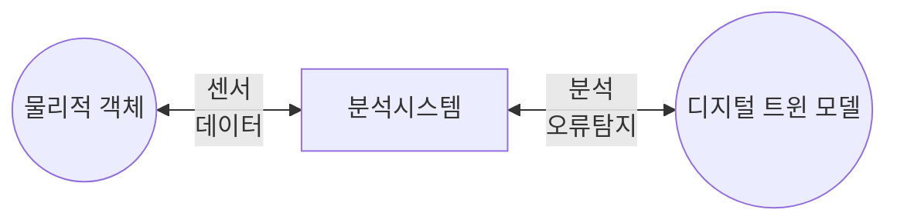

## 디지털 트윈 개념

- 현실세계의 물리적 자산, 시스템, 프로세스 등을 디지털 공간에 모델링하여 데이터를 실시간으로 모니터링, 분석, 예측하여 문제를 해결하는 기술
- 검증, 오류 수정, 시뮬레이션 등을 디지털에서 수행하여 비용절감, 위험감소

## 디지털 트윈 구성도, 구성요소, 적용방안

### 디지털 트윈 구성도

### 디지털 트윈 구성요소

| 구분 | 내용 | 비고 |
| --- | --- | --- |
| 물리적 객체 | 현실 세계의 실존 객체 | 디지털 트윈 대상 |
| 디지털 트윈 모델 | 물리 객체를 가상 공간에 복제 | 시뮬레이션 및 분석 |
| 분석 시스템 | 데이터 분석, 물리 객체 최적화 | 실시간 반영 |

### 디지털 트윈 적용방안

| 구분 | 적용방안 | 설명 |
| --- | --- | --- |
| 스마트시티 | - | - |
| 에너지 | - | - |
| 헬스케어 | - | - |
| 제조 | - | - |

## 시뮬레이션과 디지털 트윈 비교

| 구분 | 시뮬레이션 | 디지털 트윈 |
| --- | --- | --- |
| 개념 | 특정조건 동작 모방 | 가상공간 복제 |
| 데이터 | 과거, 가정 | 실시간 |
| 상호작용 | 제한적 | 현실세계 실시간 반영 |
| 목적 | 시스템 동작예측, 평가 | 현실세계 문제 해결 |

## 디지털 트윈 발전모델

| 단계 | 구분 | 설명 |
| --- | --- | --- |
| 5 | 자율 | 자율적 문제 인지 및 해결 |
| 4 | 연합 | 디지털 트윈 상호 연결 |
| 3 | 모의 | 디지털 결과 현실 객체 적용 및 최적화 |
| 2 | 관제 | 물리 객체 모니터링 |
| 1 | 모사 | 물리 객체 복제 |

- 현재 모의단계로 연합모델로 가기 위해 상호운용성과 프로토콜 표준화 필요
