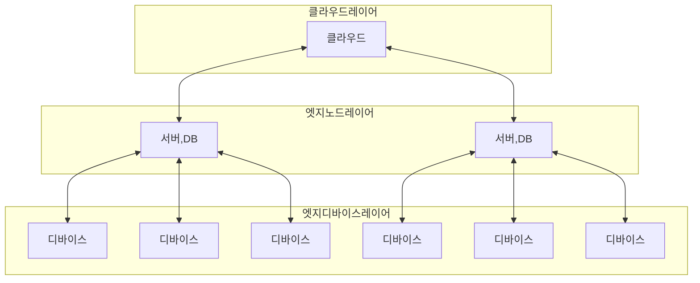

## 엣지컴퓨팅 개념

- 데이터가 생성되는 위치 근처에서 데이터를 처리하고 저장하는 분산 컴퓨팅 모델
- 빠른 응답속도, 대역폭 효율, 민감정보 로컬 처리로 인한 보안 강화

## 엣지컴퓨팅 구성도, 구성요소, 적용방안

### 엣지컴퓨팅 구성도

### 엣지컴퓨팅 구성요소

| 구분 | 내용 | 비고 |
| --- | --- | --- |
| 클라우드 | 대규모 데이터 저장, 분석 | 중앙 관리 |
| 엣지 노드 | 데이터 처리, 저장, 필터링 | 디바이스와 클라우드 간 데이터 중재 |
| 엣지 디바이스 | 데이터를 수집, 전송, 로컬 처리 | IoT 디바이스, 스마트폰 등 |

### 엣지컴퓨팅 적용방안

| 구분 | 내용 | 비고 |
| --- | --- | --- |
| 자율주행차 | 센서, 데이터 실시간 처리 | 실시간 판단, 주행 |
| 스마트시티 | 교통, 안전, 에너지 실시간 분석 | 관리 효율성 |
| 헬스케어 | 환자 데이터 실시간 모니터링 | 원격 진료 |

## 엣지컴퓨팅 장단점

| 구분 | 요소 | 내용 |
| --- | --- | --- |
| 장점 | 대기시간 감소 | - |
| - | 비용절감 | - |
| - | 실시간 데이터 처리 | - |
| 단점 | 데이터 보안 문제 | - |
| - | 복잡한 아키텍처 | - |

## 엣지컴퓨팅 고려사항

- 매터 등 IoT 표준 프로토콜을 사용하여 확장성 대응
- 분산 환경의 로컬 데이터 보안을 위해 E2E 암호화 필요
- 탄소인지컴퓨팅 패러다임으로 데이터센터의 탄소 사용량을 절감하기 위해, 엣지컴퓨팅 활성화 필요
