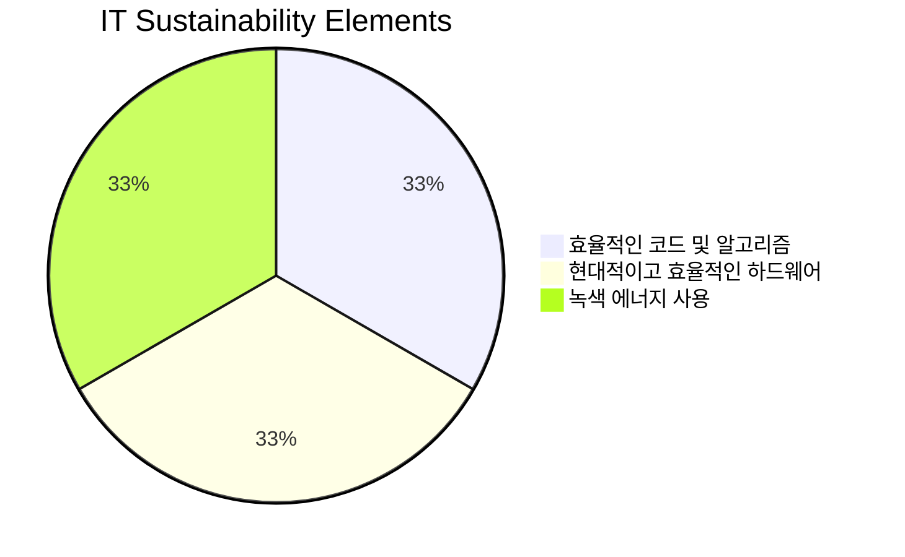

## 에너지 효율적 컴퓨팅 개념

- 컴퓨터, 데이터 센터 및 기타 디지털 시스템을 설계하고 운영하는 데 있어 에너지 소비와 탄소 발자국을 최소화하는 컴퓨팅 패러다임
- AI, 시뮬레이션, 최적화 등 고에너지 소모 기술의 증가로 환경적 부담 가중, RE100 달성, 에너지 하베스팅 기술 발전

## 에너지 효율적 컴퓨팅 개념도, 핵심요소, 활용방안

### 에너지 효율적 컴퓨팅 개념도

### 에너지 효율적 컴퓨팅 핵심요소

| 구분 | 요소 | 설명 |
| --- | --- | --- |
| 소프트웨어 | 효율적 코드 및 알고리즘 | 컴퓨팅 작업을 최소화하고 에너지 사용을 최적화하기 위한 최적화된 알고리즘 |
| 하드웨어 | 저전력, 고효율 프로세서 | 고효율 GPU, FPGA 및 뉴로모픽 칩 등 최신 하드웨어 도입 |
| 전력 관리 | 녹색 에너지 | 재생 가능 에너지 및 녹색 클라우드 서비스 사용 |
| | AI 기반 관리 | 에너지 소비 패턴 분석 및 최적화, 실시간 적응형 에너지 관리 |

### 에너지 효율적 컴퓨팅 활용방안

| 분야 | 사례 | 기대 효과 |
| --- | --- | --- |
| 제품 개발 | 에너지 효율적 시스템 설계 | 지속 가능한 제품 제공 |
| 그린 데이터 센터 | 전력 소비 감소 및 냉각 시스템 최적화 | 비용 절감 및 탄소 배출 감소 |
| 그린 클라우드 컴퓨팅 | 녹색 클라우드 지역으로 워크로드 전환 | 탄소 발자국 감소 |

## 에너지 효율적 컴퓨팅 고려사항

- 신경형 및 광 컴퓨팅 기술의 실효성을 지속적으로 평가 및 시험 운영
