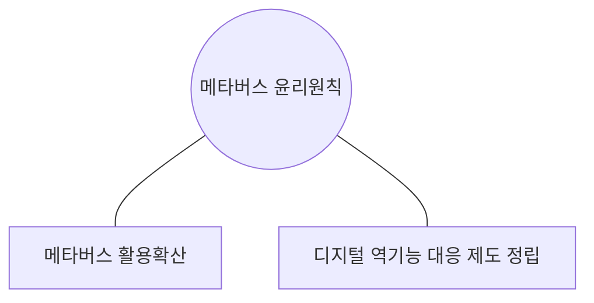
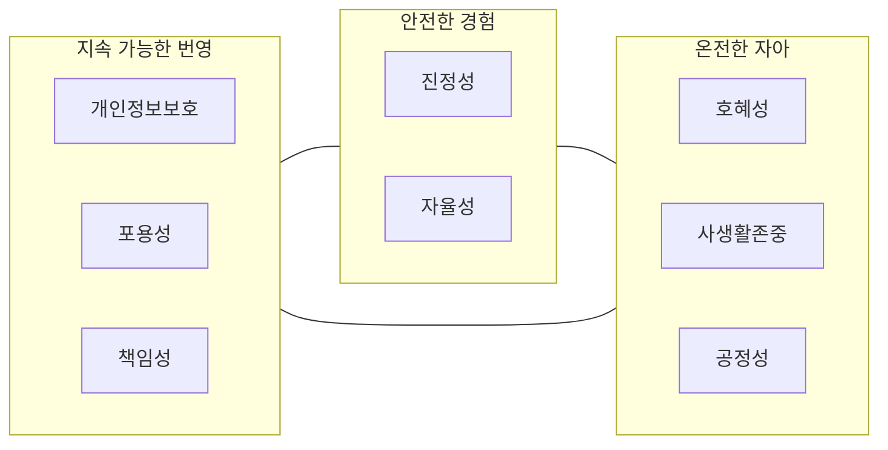
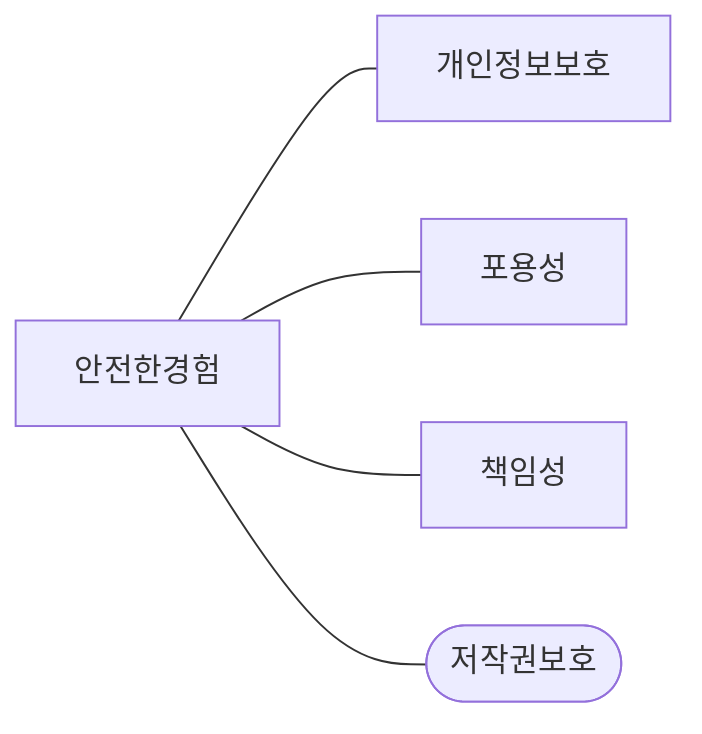

## 메타버스 윤리원칙 개념

- 메타버스를 개발, 운영하는 과정에서 모든 사회 구성원이 메타버스 내 윤리문제를 사전 인식해 자발적 정화노력에 활용할 수 있는 가이드라인
- 안전하고 신뢰할 수 있는 메타버스 환경 조성을 위해 필요

## 메타버스 윤리원칙 구성도, 구성요소, 보완점

### 메타버스 윤리원칙 구성도

- 3대 지향점, 8대 실천 원칙 제시

### 메타버스 윤리원칙 구성요소

| 구분 | 원칙 | 설명 |
| --- | --- | --- |
| 온전한 자아 | 진정성 | 자아 실현을 위한 노력 |
| | 자율성 | 능동적, 자발적 참여 |
| 지속 가능한 번영 | 호혜성 | 협력적 상호작용 |
| | 사생활존중 | 사적 영역 존중 |
| | 공정성 | 차별 없는 기회 |
| 안전한 경험 | 개인정보보호 | 정보 주체 권리 보장 |
| | 포용성 | 다양상 존중, 접근성 마련 |
| | 책임성 | 미래 세대를 위한 노력 |

- 메타버스 생태계에 참여하는 모두의 협력과 책임 필요

### 메타버스 윤리원칙 보완점

- 메타버스 내 창작물에 대한 저작권 관련 내용 부재
- 인터넷 윤리 내 저작권 침해 문제점 관련 교육 필요

## 인터넷 윤리, AI 윤리, 메타버스 윤리 비교, 저작권 윤리 추가방안

### 윤리 비교

| 구분 | 인터넷 윤리 | AI 윤리 | 메타버스 윤리 |
| --- | --- | --- | --- |
| 개념 | 인터넷 상에서 지켜야할 윤리 | AI 기술 개발 활용시 지켜야할 윤리 | 메타버스 개발, 활용시 지켜야할 윤리 |
| 문제점 | 음란물, 저작권 침해, 사생활 침해 | 인권 침해, 편향 | 사이버 폭력, 저작권 |
| 주요 가이드 | 네티즌 윤리강령 | EU AI 윤리 가이드 | 메타버스 윤리원칙 |

### 메타버스 윤리 원칙 내 저작권 윤리 추가방안

- 메타버스 내 2차 창작물에 대해 NFT 민팅을 통한 창작물 고유화, 저작권 중요성 상기

## 메타버스 윤리 활성화방안

| 구분 | 주체 | 활동 |
| --- | --- | --- |
| 홍보 | 국내 | 메타버스 윤리원칙 인지를 위한 홍보 |
| | 국외 | 메타버스 윤리원칙 번역본 배포 |
| 보급 및 확산 | 기업 | 메타버스 윤리원칙 내제화 지원 |
| | 학교 | 찾아가는 메타버스 윤리원칙 교육 |

- 메타버스 활성화를 위한 윤리 중요성 강조
- 내재화로 인한 새로운 가치 창출 가능
