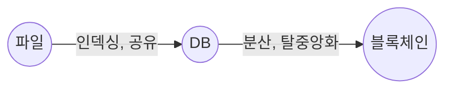
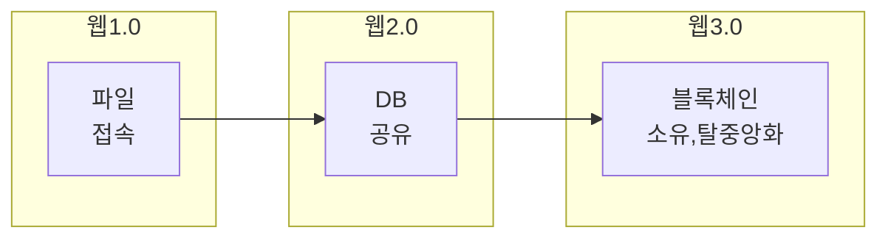
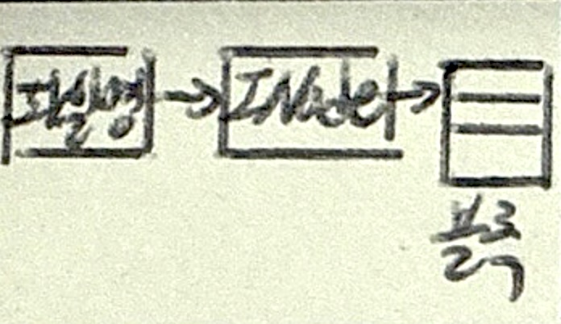
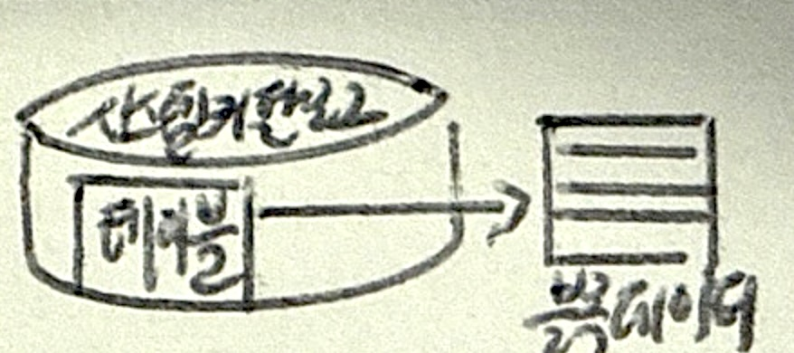
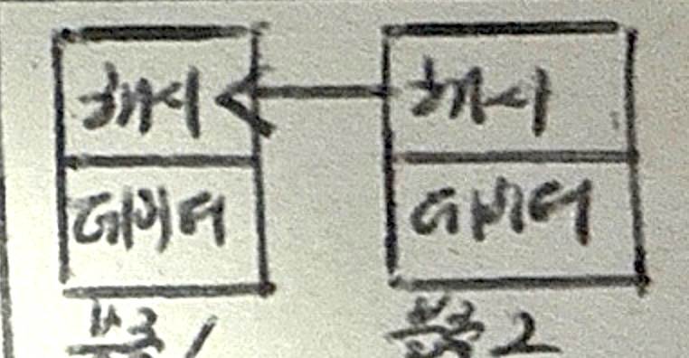

## 데이터 저장 특성 개요

### 데이터 저장 특성 개념

- 웹 서비스와 인터넷 패러다임의 변화로 인해 데이터의 저장, 접근, 처리 기술의 발전

### 데이터 저장 방식 변화의 필요성

- FS에서 인터넷의 등장으로 DB 공유, 웹3.0의 출현으로 탈중앙화와 소유의 개념을 가진 블록체인 구조에 정보 저장

## 파일, 데이터베이스, 블록체인 개념 및 비교

### 파일, 데이터베이스, 블록체인 개념

아래 그림

- FS: Inode -> block
- DB: Table, System Catalog
- BlockChain: hash based linked list block + merkle tree

### 파일, 데이터베이스, 블록체인 상세비교

| 구분 | 파일 | 데이터베이스 | 블록체인 |
| --- | --- | --- | --- |
| 개념도 |  |  |   |
| 저장단위 | 파일 | 테이블 | 블록체인 |
| 저장위치 | 로컬 | 중앙 시스템 | 분산원장 |
| 저장속도 | 빠름 | 트랜잭션처리, 빠름 | 합의알고리즘, 느림 |
| 데이터 저장 방식 | FS API | DDL, DML | 합의 알고리즘 |
| 트랜잭션 | 없음 | ACID 보장 | 합의 알고리즘으로 트랜잭션 처리 |
| 데이터 중복 | 단일 데이터 | 역정규화로 일부 허용 | 참여자 전체 중복 저장 |
| 종류 | FAT, NFTS | RDBMS, NoSQL | Public, Private, Hybrid |

## 블록체인 저장 방식의 문제점과 해결방안

### 블록체인 저장 방식의 문제점

- 탈중앙화, 확장성, 보안성 중 모두를 만족할 수 없는 ==블록체인 트릴레마== 존재
- 합의 알고리즘 수행에 시간이 걸리므로, 실시간 웹 서비스에는 부적합

### 블록체인 저장 특성 문제 해결방안

| 구분 | 내용 | 비고 |
| --- | --- | --- |
| ==레이어링== | 데이터와 처리계층의 분리로 확장성 향상 | 오프체인, 사이드체인 |
| ==샤딩== | 데이터 불할 처리로 확장성 향상 | 체인네트워크 샤딩, 코디네이션 |
| 하이브리드 | 중앙집중과 탈중앙화의 절충점으로 신뢰성, 보안성, 실시간성 강화 | RDBMS, 카프카 사용 |

- 블록체인 트릴레마와 실시간성 극복을 위해 데이터를 분리하여 처리

## 파일, 데이터베이스, 블록체인 적용방안

| 파일 | 데이터베이스 | 블록체인 |
| --- | --- | --- |
| 개인/기업 데이터저장 | 엔터프라이즈 어플리케이션 | 암호화폐 |
| 멀티미디어 | 웹 어플리케이션 | 공급망 관리|
| IPFS | 빅데이터 분석 | 스마트 컨트랙트 |
