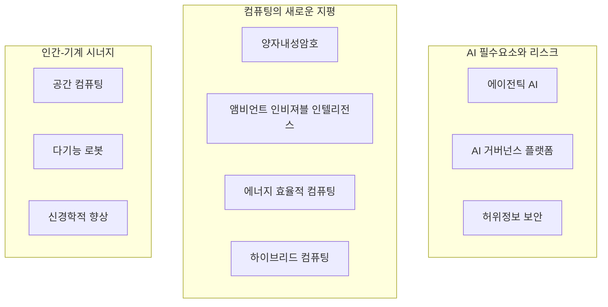

## 가트너 2025

### 가트너 2025 구성도

### 가트너 2025 구성요소

- AI 필수요소와 리스크
  - [에이전틱 AI](../algo/agentic-ai.md)
  - [AI 거버넌스 플랫폼](../algo/ai-governance-platform.md)
  - [허위정보 보안](../sec/disinformation-security.md)
- 컴퓨팅의 새 지평
  - [양자내성암호](../sec/post-quantum-cryptography.md)
  - [앰비언트 인비저블 인텔리전스](./ambient-invisible-intelligence.md)
  - [에너지 효율적 컴퓨팅](./energy-efficient-computing.md)
  - [하이브리드 컴퓨팅](./hybrid-computing.md)
- 인간-기계 시너지
  - [공간 컴퓨팅](./spatial-computing.md)
  - [다기능 로봇](./polyfunctional-robots.md)
  - [신경학적 향상](./neurological-enhancement.md)
