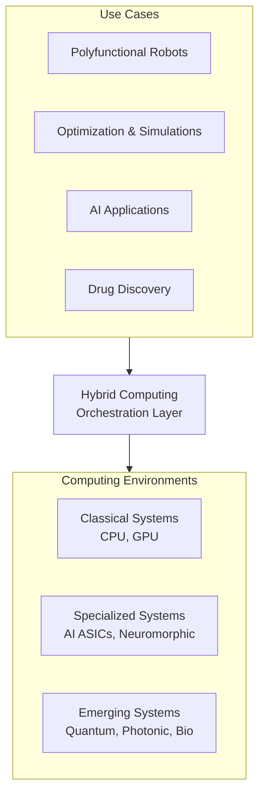

## 하이브리드 컴퓨팅 개념

- 고전적 컴퓨팅(CPU, GPU)과 차세대 기술(양자, 광자, 뉴로모픽)을 통합하여 ==오케스트레이션== 하고 복잡한 문제를 해결하는 컴퓨팅 패러다임
- 데이터 증가와 복잡한 분석 요구, 단일 기술로는 해결할 수 없는 문제로 다중 컴퓨팅 환경의 조화 필요

### 하이브리드 컴퓨팅 아키텍처, 핵심요소, 활용방안

### 하이브리드 컴퓨팅 아키텍처

### 하이브리드 컴퓨팅 핵심요소

| 구분 | 핵심요소 | 설명 |
| --- | --- | --- |
| 컴퓨팅 환경 | 고전적 시스템 | CPU와 GPU는 대규모 데이터 처리를 위한 기본 요소로, 기존 컴퓨팅 워크로드를 담당 |
| | 차세대 시스템 | 양자, 광자, 뉴로모픽 기술은 복잡한 최적화 문제와 고차원 데이터 분석에 적합 |
| 오케스트레이션 계층 | 데이터 패브릭 | 통합 데이터 관리를 통해 서로 다른 시스템 간의 상호 운용성을 제공 |
| | 워크플로 관리 | 워크플로를 효율적으로 조정하여 시간과 자원을 절약 |
| 지원 요소 | 보안 및 거버넌스 | 자율적으로 작동하는 시스템 간 데이터 전송과 보안을 위한 정밀한 관리 |
| |변화 수용성 | 빈번한 기술 변화와 실패를 수용할 수 있는 유연한 조직 구조 필요 |

### 하이브리드 컴퓨팅 활용방안

| 분야 | 사례 | 기대 효과 |
| --- | --- | --- |
| 제조 | AI와 뉴로모픽 컴퓨팅을 결합하여 생산 라인 자동화 | 생산성 향상 및 운영 비용 절감 |
| 금융 서비스 | 양자 컴퓨팅 기반 금융 모델링 | 초고속 리스크 분석 및 사기 탐지 |
| 생명과학 | 양자 및 광학 컴퓨팅을 활용한 신약 개발 | 신약 발견 속도 증가 및 연구비용 절감 |

### 하이브리드 컴퓨팅 도입시 고려사항

- 통합 아키텍처를 설계하여 하이브리드 시스템 간 상호 운용성 향상 필요
- ATAM, CBAM 통해 조직 내 적합한 기술 융합 필요
